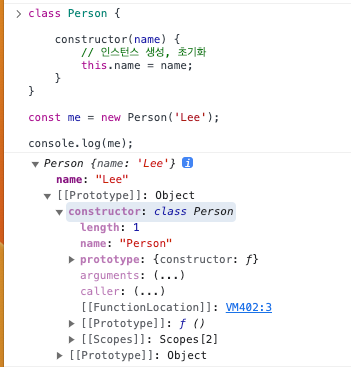

# 25. 클래스

## 25.1 클래스는 프로토타입의 문법적 설탕인가?

> 자바스크립트는 프로토타입 기반 객체지향 언어다. 다른 객체지향 언어와의 차이점에 대한 논쟁이 있지만 자바스크립트는 강력한 객체지향 프로그래밍 능력을 가지고 있다.

> 프로토타입 기반 객체지향 언어는 클래스가 필요 없는 객체지향 프로그래밍 언어다. ES5 에서는 클래스 없이도 다음과 같이 생성자 함수와 프로토타입을 통해 객체지향 언어의 상속을 구현할 수 있다.

```javascript
var Person = (function (){
    function Person(name) {
        this.name = name;
    }
    
    Person.prototype.sayHi = function () {
        console.log(`Hello world ${this.name}`);
    }
    
    return Person;
})();

var me = new Person('Lee');

me.sayHi();
```

> ES6 에서 도입된 클래스는 기존 프로토타입 기반 객체지향 프로그래밍보다 자바나 C# 같은 클래스 기반 객체지향 프로그래밍에 익숙한 프로그래머가
> 빠르게 학습 가능하도록 클래스 기반 객체지향 프로그래밍 언어와 흡사한 객체 생성 메커니즘을 제시한다.

> ES6 클래스가 기존의 프로토타입 기반 객체지향 모델을 폐지하고 새롭게 클래스 기반 객체지향 모데을 제공하는 것은 아니다.
> 클래스는 함수이며 기존 프로토타입 기반 패턴을 클래스 기반 패턴처럼 사용할 수 있도록 하는 문법적 설탕 이라고 할 수 있다.

> 클래스와 생성자 함수는 모두 프로토타입 기반 인스턴스를 생성하지만 정확히 동일하게 동작하지 않는다.

1. 클래스를 new 연산자 없이 호출하면 에러가 발생한다. 생성자 함수를 new 연산자 없이 호출하면 일반 함수로서 호출된다.
2. 클래스는 상속을 지원하는 extends super 키워드를 제공한다. 생성자 함수는 지원하지 않는다.
3. 클래스는 호이스팅이 발생하지 않는 것처럼 동작한다. 함수 선언문으로 정의된 생성자 함수는 함수 호이스팅이 함수 표현식으로 정의한 생성자 함수는 뱐수 호이스팅이 발생한다.
4. 클래스 내의 모든 코드에 strict mode 가 지정되어 실행되며 해제할 수 없다. 생성자 함수는 지정되지 않는다.
5. 클래스의 constructor 프로토타입 메서드 정적 메서드는 모두 프로퍼티 어트리뷰트 [[Enumerable]] 값이 false 다.

> 생성자 함수와 클래스는 프로토타입 기반의 객체지향을 구현했다는 점에서 매우 유사하다. 하지만 클래스는 생성자 함수 기반의 객체 생성 방식보다 견고하고 명료하다.

> 새로운 객체 생성 메커니즘으로 봐야한다.

## 25.2 클래스 정의

> 클래스는 class 키워드를 사용하여 정의한다.
```javascript
class Person {}
```

> 함수와 마찬가지로 표현식으로 클래스를 정의할 수도 있다.

```javascript
const Person = class {};

const Person = class MyClass {};
```

> 클래스를 표현식으로 정의할 수 있다는 것은 클래스가 값으로 사용할 수 있는 일급 객체라는 것을 의미한다.

> 클래스 몸체에는 0개 이상의 메서드만 정의할 수 있다. 몸체에서 정의할 수 있는 메서드는 constructor , 프로토타입 메서드, 정적 메서드 세 가지가 있다.

```javascript
class Person {
    constructor(name) {
        this.name = name;
    }
    
    sayHi() {
        console.log(`Hello world ${this.name}`)
    }
    
    static sayHello() {
        console.log('Hello');
    }
}

const me = new Person('Lee');

console.log(me.name);
me.sayHi();

Person.sayHello();
```

> 클래스와 생성자 함수의 정의 방식을 비교해 보면 다음과 같다.

```javascript
var Person = (function () {
    function Person(name) {
        this.name = name;
    }
    
    Person.prototype.sayHi = function () {
        console.log(`Hello world ${this.name}`)
    };
    
    Person.sayHello = function () {
        console.log('hi')
    }
})();
```

## 25.3 클래스 호이스팅

> 클래스는 함수로 평가된다.

```javascript
class Person {}

console.log(typeof Person); // function
```

> 클래스 선언문으로 정의한 클래스는 함수 선언문과 같이 소스코드 평가 과정, 런타임 이전에 먼저 평가되어 함수 객체를 생성한다.
> 이때 클래스가 평가되어 생성된 함수 객체는 생성자 함수로서 호출할 수 있는 함수 constructor 다.

## 25.4 인스턴스 생성

> 클래스는 생성자 함수이며 new 연산자와 함께 호출되어 인스턴스를 생성한다.

> 함수는 new 연산자의 사용 여부에 따라 일반 함수로 호출하거나 인스턴스 생성을 위한 생성자 함수로 호출되지만 클래스는 인스턴스를 생성하는 것이 유일한 존재 이유이므로
> new 연산자를 반드시 함께 호출해야 한다.

```javascript
class Person {};

const me = Person(); // TypeError
```

## 25.5 메서드

### 25.5.1 constructor

> constructor 는 인스턴스를 생성하고 초기화하기 위한 특수한 메서드다. 

```javascript
class Person {
    
    constructor(name) {
        // 인스턴스 생성, 초기화
        this.name = name;
    }
}
```

> 클래스도 함수 객체 고유의 프로퍼티를 모두 갖고 있다.
> 함수와 동일하게 프로토타입과 연결되어 있으며 자신의 스코프 체인을 구성한다.

> 모든 함수 객체가 가지고 있는 prototype 프로퍼티가 가리키는 프로토타입 객체 constructor 프로퍼티는 클래스 자신을 가리킨다.

```javascript
const me = new Person('Lee');

console.log(me);
```



> Person 클래스의 constructor 내부에서 this 에 추가한 name 프로퍼티가 클래스가 생성한 인스턴스의 프로퍼티로 추가되어있다.

> constructor 는 메서드로 해석되는 것이 아니라 클래스가 평가되어 생성한 함수 객체 코드의 일부가 된다.

### 클래스의 constructor 메서드와 프로토타입 constructor 프로퍼티

> 직접적인 관련이 없다. 프로토타입 constructor 는 모든 프로토타입이 가지고 있는 프로퍼티이며 생성자 함수를 가리킨다.

> constructor 는 클래스 내에 최대 한 개만 존재할 수 있다.

> constructor 를 생략하면 암묵적으로 빈 constructor 가 생성된다.

> 프로퍼티가 추가되어 초기화된 인스턴스를 생성하려면 constructor 내부에서 this 인스턴스 프로퍼티를 추가한다.

```javascript
class Person {
    constructor() {
        this.name = 'Lee';
        this.address = 'Seoul';
    }
}

// 인스턴스 추가
const me = new Person();
console.log(me); // Person {name: 'Lee', address: 'Seoul' }
```

> 인스턴스를 생성할 때 클래스 외부에서 인스턴스 프로퍼티 초기값을 전달하려면 constructor 매개변수를 선언하고 전달한다.

```javascript
class Person {
    constructor(name, address) {
        this.name = name;
        this.address = address;
    }
}

const me = new Person('Lee', 'Seoul');
console.log(me);
```

> constructor 는 별도의 반환문을 갖지 않아야 한다.
> 만약 this 가 아닌 다른 객체를 명시적으로 반환하면 this, 즉 인스턴스가 반환되지 못하고 객체가 반환된다.

### 25.5.2 프로토타입 메서드

> 생성자 함수를 사용하여 인스턴스를 생성하는 경우 프로토타입 메서드를 생성하기 위해서 다음과 같이 명시적으로 프로토타입에 메서드를 추가해야 한다.

```javascript
function Person(name) {
    this.name = name;
}

Person.prototype.sayHi = function () {
    console.log(`Hello world ${this.name}`)
}
```

> 클래스 몸체에서 정의한 메서드는 생성자 함수에 의한 객체 생성 방식과는 다르게 클래스의 prototype 프로퍼티에 메서드를 추가하지 않아도 기본적으로 프로토타입 메서드가 된다.

> 클래스는 생성자 함수와 같이 인스턴스를 생성하는 생성자 함수라고 볼 수 있다. 프로토타입 기반의 객체 생성 메커니즘이다.

### 25.5.3 정적 메서드

> 인스턴스를 생성하지 않아도 호출할 수 있는 메서드를 말한다.

> 클래스에서는 static 키워드를 붙이면 정적 메서드가 된다.

> 정적 메서드는 인스턴스로 호출할 수 없다. 정적 메서드가 바인딩된 클래스는 인스턴스의 프로토타입 체인상에 존재하지 않기 떄문이다.

### 25.5.4 정적 메서드와 프로토타입 메서드 차이

> 정적 메서드와 프로토타입 메서드는 자신이 속해 있는 프로토타입 체인이 다르다.
> 정적 메서드는 클래스로 호출하고 프로토타입 메서드는 인스턴스로 호출한다.
> 정적 메서드는 인스턴스 프로퍼티를 참조할 수 없지만 프로토타입 메서드는 인스턴스 프로퍼티를 참조할 수 있다.

### 25.5.5 클래스에서 정의한 메서드의 특징

1. function 키워드를 생략학 메서드 축약 표현을 사용한다.
2. 객체 리터럴과는 다르게 클래스에 메서드를 정의할 때는 콤마가 필요 없다.
3. 암묵적으로 strict mode 가 실행된다.
4. for ... in 문이나 Object.keys 메서드 등으로 열거할 수 없다.
5. 내부 메서드 [[Construct]] 를 갖지 않는 non-constructor 다. new 연산자와 함께 호출할 수 없다.

## 25.6 클래스 인스턴스 생성 과정

> new 연산자와 함께 클래스를 호출하면 생성자 함수와 마찬가지로 클래스 내부 메서드 [[Construct]] 가 호출된다.

1. 인스턴스 생성과 this 바인딩
    - 암묵적으로 빈 객체가 생성되며 이 빈 객체가 클래스가 생성한 인스턴스다.
    - 클래스가 생성한 인스턴스의 프로토타입으로 클래스 prototype 프로퍼티가 가리키는 객체가 설정된다.
    - 암묵적으로 생성된 빈 객체 인스턴스는 this 에 바인딩된다.
2. 인스턴스 초기화
    - constructor 내부 코드가 실행되어 this 에 바인딩되어 있는 인스턴스를 초기화 한다.
    - constructor 가 생략되었다면 생략된다.
3. 인스턴스 반환
    - 클래스의 모든 처리가 끝나면 인스턴스가 바인딩된 this 가 암묵적으로 반환된다.

## 25.7 프로퍼티

### 25.7.1 인스턴스 프로퍼티

> 인스턴스 프로퍼티는 constructor 내부에서 정의해야 한다.
> 인스턴스 프로퍼티는 public 이다.

### 25.7.2 접근자 프로퍼티

> 접근자 프로퍼티는 클래스에서도 사용 가능하다.

```javascript
class Person {
    constructor(firstName, lastName) {
        this.firstName = firstName;
        this.lastName = lastName;
    }
    
    get fullName() {
        return `${this.firstName} ${this.lastName}`
    }
    
    set fullName(name) {
        [this.firstName, this.lastName] = name.split(' ');
    }
}

const me = new Person('Ungmo', 'Lee');

me.fullName = 'Heegun Lee'; // setter

console.log(me.fullName); // Heegun Lee Getter
```

> 이때 getter setter 이름은 인스턴스 프로퍼티처럼 사용된다.
> getter 는 호출되는 것이 아니라 참조하는 형식으로 사용한다. 참조 시에 내부적으로 getter 가 호출된다.

```javascript
Object.getOwnPropertyNames(me); // ['firstName', 'lastName']
Object.getOwnPropertyNames(Object.getPrototypeOf(me)); // ['constructor', 'fullName']
```

### 25.7.3 클래스 필드 정의 제안

> 클래스 필드는 클래스 기반 객체지향 언어에서 클래스가 생성할 인스턴스의 프로파티를 가리키는 용어다.
> 자바스크립트 클래스에서 인스턴스 프로퍼티를 선언하고 초기화하려면 반드시 constructor 내부에서 this 프로퍼티를 추가해야 한다.

```javascript
class Person {
    name = 'Lee';
}

const me = new Person('Lee');
```

> 하지만 위 예제를 최신 브라우저 또는 Node.js (12) 이상에서 실행하면 문법 에러가 발생하지 않고 정상 동작한다.

> 자바스크립트에서도 인스턴스 프로퍼티를 마치 클래스 기반 객체지향 언어의 클래스 필드처럼 정의할 수 있는 새로운 표준 사양인 Class field declarations 가 
> 2021년 1월 TC39 프로세스 stage3 에 제안되어 있다.

> 모든 클래스 필드는 인스턴스 프로퍼티가 된다. 클래스 필드에 함수를 할당하는 것은 권장하지 않는다.

> 클래스 필드 정의 제안으로 인해 인스턴스 프로퍼티를 정의하는 방식은 두 가지가 되었다. 인스턴스를 생성할 때 외부 초기값으로 클래스 필드를 초기화할 필요가 있다면
> constructor 인스턴스 프로퍼티를 정의하는 기존 방식을 사용

### 25.7.4 private 필드 정의 제안

> ES NEXT 에서 private 필드를 정의할 수 있는 새로운 표준 사양이 제안되었다.

```javascript
class Person {
    #name = '';
    
    constructor(name) {
        this.#name = name;
    }
}

const me = new Person('Lee');

console.log(me.#name); // SyntaxError
```

### 타입스크립트

> 클래스 기반 객체지향 언어가 지원하는 접근 제어자 public, private, protected 모두 지원한다.

> private 필드는 반드시 몸체에 정의해야 한다. private 필드를 직접 constructor 에 정의하면 에러가 발생한다.

### 25.7.5 static 필드 정의 제안

> static 키워드를 사용하여 정적 메서드를 정의 할 수 있다.하지만 static 키워드를 사용하여 정적 필드를 정의할 수는 없었다.
> 하지만 static public static private static 필드 메서드를 정의할 수 있는 static class feature 가 제안되어있다.

```javascript
class MyMath {
    // static public 필드
    static PI = 22 / 7;
    
    // static private 필드
    static #num = 10;
    
    // static 메서드
    static increment() {
        return ++MyMath.#num;
    }
}
```

## 25.8 상속에 의한 클래스 확장

### 25.8.1 클래스 상속과 생성자 함수 상속

> 상속에 의한 클래스 확장은 기존 클래스를 상속받아 새로운 클래스를 확장하여 정의하는 것이다.

> 클래스와 생성자 함수는 인스턴스를 생성할 수 있는 함수라는 점에서 유사하다.
> 하지만 클래스는 상속을 통해 기존 클래스를 확잘할 수 있는 문법이 기본적으로 제공되지만 생성자 함수는 그렇지 않다.

```javascript
class Animal {
    constructor(age, weight) {
        this.age = age;
        this.weight = weight;
    }
    
    eat() {return 'eat'}
    
    move() {return 'move'}
}

class Bird extends Animal {
    fly() {return 'fly'}
}

const bird = new Bird(1, 5);

console.log(bird instanceof Bird); // true
console.log(bird instanceof Animal); // true
```

> 클래스는 상속을 통해 다른 클래스를 확장할 수 있는 문법인 extends 키워드가 제공된다.

> 자바스크립트 언어는 클래스 기반이 아니므로 생성자 함수를 사용하여 클래스를 흉내 내려는 시도를 권장하지 않지만
> 클래스 상속 패턴을 사용하여 상속에 의한 클래스 확장을 흉내 내기도 했다.

### 25.8.2 extends 키워드

> 상속을 통해 확장된 클래스를 서브클래스라 부르고 서브클래스에게 상속된 클래스를 수퍼 클래스라 부른다.

> 수퍼클래스와 서브클래스는 인스턴스의 프로토타입 체인뿐 아니라 클래스 간의 프로토타입 체인도 생성한다. 
> 이를 통해 프로토타입 메서드, 정적 메서드 모두 상속이 가능하다.

### 25.8.3 동적 상속

> extends 키워드는 클래스 뿐만 아니라 생성자 함수를 상속받아 클래스를 확장할 수 있다.

```javascript
function Base(a) {
    this.a = a;
}

class Derived extends Base {};

const derived = new Derived(1);
console.log(derived); // Derived {a: 1}
```

> extends 키워드 다음에는 클래스뿐만 아니라 [[Construct]] 내부 메서드를 갖는 함수 객체로 평가될 수 있는 모든 표현식을 사용할 수 있다.

### 25.8.4 서브클래스 constructor

```javascript
constrcutor(...args) {super(...args)}
```

> super() 는 슈퍼클래스 constructor 를 호출하여 인스턴스를 생성한다.

### 25.8.5 super 키워드

> super 키워드는 함수처럼 호출할 수도 있고 this 와 같이 식별자처럼 참조할 수 있는 특수한 키워드다.
> super 는 다음과 같이 동작한다.

1. super 를 호출하면 슈퍼클래스 constructor(super-constructor) 를 호출한다.
2. super 를 참조하면 슈퍼클래스 메서드를 호출할 수 있다.

### super 호출

> super 를 호출할 때 주의할 사항은 다음과 같다.

1. 서브클래스에서 constructor 를 생략하지 않은 경우 서브클래스의 constructor 에서는 반드시 super 를 호출해야 한다.
2. 서브클래스 constructor 에서 super 를 호출하기 전에는 this 를 참조할 수 없다.
3. super 는 반드시 서브클래스 constructor 에서만 호출된다.

### super 참조

> 메서드 내에서 super 를 참조하면 슈퍼클래스 메서드를 호출할 수 있다.

1. 서브클래스 프로토타입 메서드 내에서 super.sayHi 는 슈퍼클래스 프로토타입 메서드 sayHi 를 가리킨다.
```javascript
class Base {
    constructor(name) {
        this.name = name;
    }
    
    sayHi() {
        return `Hi ${this.name}`
    }
}

class Derived extends Base {
    sayHi() {
        return `${super.sayHi()} how are you doing`
    }
}
```

> super 는 자신을 참조하고 있는 메서드가 바인딩되어 있는 객체의 프로토타입을 가리킨다.
> 따라서 super.sayHi 는 Base.prototype.sayHi 를 가리킨다.

> 단 Base.prototype.sayHI 를 호출할 때 call 메서드를 사용해 this 를 전달해야 한다.

> call 메서드를 사용해 this 를 전달하지 않고 그대로 호출하면 메서드 내부의 this 는 Base.prototype 을 가리킨다.
> 내부의 this 는 Base.prototype 이 아니라 인스턴스를 가리켜야 한다.

> 이처럼 super 참조가 동작하기 위해서는 super 를 참조하고 있는 메서드가 바인딩되어 있는 개체의 프로토타입을 찾을 수 있어야 한다.

> 이를 위해 내부 슬롯 [[HomeObject]] 를 가지며 자신을 바인딩하고 있는 객체를 가리킨다.

> 주의할 점은 ES6 메서드 축약 표현으로 정의된 함수만이 [[HomeObject]] 를 갖는다.

2. 서브클래스 정적 메서드 내에서 super.sayHi 는 슈퍼클래스 정적 메서드 sayHi 를 가리킨다.

```javascript
class Base {
    constructor(name) {
        this.name = name;
    }
    
    sayHi() {
        return `Hi ${this.name}`
    }
}

class Derived extends Base {
    sayHi() {
        // super.sayHi 는 슈퍼클래스 정적 메서드를 가리킨다.
        return `${super.sayHi()} how are you doing`
    }
}
```

### 25.8.6 상속 클래스의 인스턴스 생성 과정

```javascript
class Rectangle {
    constructor(width, height) {
        this.width = width;
        this.height = height;
    }
    
    getArea() {
        return this.width * this.height;
    }
    
    toString() {
        return `width = ${this.width}, height = ${this.height}`
    }
}

class ColorRectangle extends Rectangle {

    constructor(width, height, color) {
        super.constructor(width, height);
        this.color = color;
    }
    
    toString() {
        return super.toString() + `, color = ${this.color}`
    }
}
```

1. 서브클래스 super 호출

> 자바스크립트 엔진은 클래스를 평가할 때 슈퍼클래스와 서브클래스를 구분하기 위해서 "base" 또는 "derived" 를 값으로 갖는 내부 슬롯 [[ConstructorKind]] 를 갖는다.

> 다른 클래스로 상속받지 않는 클래스는 내부 슬롯의 값이 base 로 설정되지만 상속받는 클래스는 derived 로 설정된다.

> 서브클래스는 자신이 직접 인스턴스를 생성하지 않고 슈퍼클래스에게 인스턴스 생성을 위임한다. 이것이 바로 서브클래스의 constructor 에서 반드시 super를 호출하는 이유다.

> 서브클래스가 new 연산자와 함께 호출되면 서브클래스 constructor 내부의 super 키워드가 함수처럼 호출된다.
> 슈퍼클래스가 평가되어 생성된 함수 객체의 코드가 실행되기 시작한다.

2. 슈퍼클래스 인스턴스 생성과 this 바인딩

> 슈퍼클래스 constructor 내부의 코드가 실행되기 이전에 암묵적으로 빈 객체를 생성한다.
> 빈 객체 인스턴스는 this 에 바인딩된다. 슈퍼클래스 constructor 내부의 this 는 생성된 인스턴스를 가리킨다.

```javascript
class Rectangle {
    constructor(width, height) {
        console.log(this); // ColorRectangle
    }
}
...
```

> 인스턴스는 슈퍼클래스가 생성한 것이다 하지만 new 연산자와 함께 호출된 클래스가 서브클래스라는 것이 중요하다.
> 인스턴스는 new.target 이 가리키는 서브클래스가 생성한 것으로 처리된다.

3. 슈퍼클래스의 인스턴스 초기화

> 슈퍼클래스 constructor 가 실행되어 this 에 바인딩되어 있는 인스턴스가 초기화한다.
> this 에 바인딩 되어 있는 인스턴스에 프로퍼티를 추가하고 constructor 가 인수로 전달받은 초기값으로 인스턴스 프로퍼티를 초기화 한다.

4. 서브클래스 constructor 로의 복귀와 this 바인딩

> super 의 호출이 종료되고 제어 흐름이 서브클래스 constructor 로 돌아온다.
> 이떄 super 가 반환한 인스턴스가 this에 바인딩된다.

> 서브클래스는 별도의 인스턴스를 생성하지 않고 super 가 반환한 인스턴스를 this 에 바인딩하여 그대로 사용한다.

> 이처럼 super 가 호출되지 않으면 인스턴스가 생서되지 않으며 this 바인딩도 할 수 없다.
> 서브클래스의 constructor 에서 super 를 호출하기 전까지 this 를 참조할 수 없는 이유이다.

5. 서브클래스 인스턴스 초기화

> super 호출 이후 constructor에 기술되어 있는 인스턴스 초기화가 실행된다. this 에 바인딩되어 있는 인스턴스에 프로퍼티를 추가하고 constructor 가 인수로 전달받은
> 초기값으로 인스턴스 프로퍼티를 초기화한다.

6. 인스턴스 반환

> 클래스의 모든 처리가 끝나면 완성된 인스턴스가 바인딩된 this 가 암묵적으로 반환된다.

### 25.8.7 표준 빌트인 생성자 함수 확장

> String, Number, Array 같은 표준 빌트인 객체도 [[Construct]] 내부 슬롯을 가지고 있으므로 extends 키워드를 사용하여 확장할 수 있다.

```javascript
class MyArray extends Array {
    uniq() {
        return this.filter((v, i, self) => self.indexOf(v) === i);
    }
}

const myArray = new MyArray(1,1,2,3);

console.log(myArray.uniq()); // MyArray(3) [1,2,3]
```

> 주의점은 Array.prototype 메서드 중 map, filter 같이 새로울 배열을 반환하는 메서드가 클래스 인스턴스를 반환한다는 점이다.

> 만약 MyArray 클래스의 uniq 메서드가 클래스가 생성한 인스턴스가 아닌 Array 가 생성한 인스턴스를 반환하게 하려면 Symbol.species 를 사용하여 정적 접근자 프로퍼티를 추가한다.

```javascript
class MyArray extends Array {
    static get [Symbol.species]() {return Array}
    
    ...
}

console.log(myArray.uniq() instanceof MyArray); // false
console.log(myArray.uniq() instanceof Array); // true
```

---

[] 클래스는 생성 방식에 대해서 서술하시오.

[] 클래스 프로퍼티에 대해서 서술하시오

[] 클래스 constructor 에 대해서 서술하시오.

[] 클래스 상속에 대해서 서술하시오.