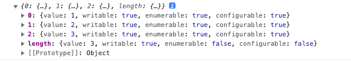

# 27. 배열

## 27.1 배열이란

> 여러 개의 값을 순차적으로 나열한 자료구조

```javascript
const arr = ['apple', 'banana', 'orange'];
```

> 배열이 가진 값을 요소 라고 부른다.

> 배열의 요소는 배열에서 자신의 위치를 나타내는 0 이상의 정수 인덱스를 가진다.

> 요소에 접근할 때는 대괄호 표기법을 사용한다.

> 배열은 배열 리터럴, Array 생성자 함수, Array.of, Array.from 메서드로 생성 가능하다. 배열의 프로토타입 객체는 Array.prototype 이다.

## 27.2 자바스크립트 배열은 배열이 아니다.

> 자려구조에서 말하는 배열은 동일한 크기의 메모리 공간이 빈틈없이 연속적으로 나열된 자료구조를 말한다.
> 배열의 요소는 하나의 데이터 타입으로 통일되어 있으며 서로 연속적으로 인접해 있다. 이러한 배열을 밀집 배열 이라 한다.

> 이처럼 일반적인 의미의 배열은 각 요소가 동일한 데이터 크기를 가지며 빈틈없이 연속적으로 이어져 있으므로 인덱스를 통해 단 한번의 연산으로 임의의 요소에 접근할 수 있다.
> 이는 매우 효율적이고 고속으로 동작한다.

> 하지만 정렬되지 않은 배열에서 특정한 요소를 검색하는 경우 배열의 모든 요소를 처음부터 특정 요소를 발견할 때까지 차례대로 검색해야 한다.

> 자바스크립트의 배열은 지금까지 살펴본 자료구조에서 말하는 일반적인 의미의 배열과 다르다. 즉 배열의 요소를 위한 각각의 메모리 공간은
> 동일한 크기를 갖지 않아도 되며, 연속적으로 이어져 있지 않을 수도 있다.

> 배열의 요소가 연속적으로 이어져 있지 않은 배열을 희소 배열 이라 한다.

> 자바스크립트 배열은 일반적 의미의 배열이 아니다. 자바스크립트 배열은 일반적인 배열의 동작을 흉내 낸 특수한 객체다.

```javascript
console.log(Object.getOwnPropertyDescriptors([1,2,3]));
```


> 자바스크립트 배열은 인덱스를 나타내는 문자열을 프로퍼티 키로 가지며 length 프로퍼티를 갖는 특수한 객체다.

> 자바스크립트에서 사용할 수 있는 모든 값은 객체의 프로퍼티 값이 될 수 있으므로 어떤 타입의 값이라도 배열의 요소가 될 수 있다.

1. 일반적인 배열은 인덱스로 요소에 빠르게 접근이 가능하다. 하지만 삽입 또는 삭제에는 효율적이지 않다.
2. 자바스크립트 배열은 해시 테이블로 구현된 객체이므로 일반적인 배열보다 성능적인 면에서 느릴 수밖에 없는 구조적인 단점이 있다. 하지만 요소를 삽입 또는 삭제에는 빠른 성능을 기대할 수 있다.

### 27.3 length 프로퍼티와 희소 배열

> length 프로퍼티는 요소의 개수, 배열의 길이를 나타내는 0 이상의 정수를 값으로 갖는다.

> 희소 배열은 length 와 배열 요소의 개수가 일치하지 않는다. 희소 배열의 length 는 희소 배열의 실제 요소 개수보다 언제나 크다.

> 배열을 생성할 경우에 희소 배열을 생성하지 않도록 주의하자.

### 27.4 배열 생성

### 27.4.1 배열 리터럴

```javascript
const arr = [1,2,3];

const arr2 = [1, , 3]; // 희소 배열
```

### 27.4.2 Array 생성자 함수

> Array 생성자 함수는 전달된 인수의 개수에 따라 다르게 동작하므로 주의가 필요하다.

```javascript
const arr = new Array(10);

console.log(arr); // [empty * 10]
```

### 27.4.3 Array.of

> ES6 에서 도입된 메서드. 전달된 인수를 요소로 갖는 배열을 생성

```javascript
Array.of(1); // [1]

Array.of(1,2,3); // [1,2,3]

Array.of('string'); // ['string']
```

### 27.4.4 Array.from

> 유사 배열 객체 또는 이터러블 객체를 인수로 전달받아 배열로 변환한다.

```javascript
Array.from({length: 2, 0: 'a', 1: 'b'}); // ['a', 'b']

Array.from({length: 3}, (_, i) => i); // [0,1,2]
```

## 27.5 배열 요소의 참조

> 배열의 요소를 참조할 때에는 대괄호 표기법을 사용하고 인덱스가 와야 한다.

## 27.6 배열 요소의 추가와 갱신

> 객체에 프로퍼티를 동적으로 추가할 수 있는 것처럼 배열에도 요소를 동적으로 추가 가능하다.

```javascript
const arr = [0];

arr[1] = 1;

console.log(arr); // [0, 1]
```

## 27.7 배열 요소 삭제

```javascript
const arr = [1,2,3];

delete arr[1];

console.log(arr, arr.length); // [1, empty, 3], 3
```

> 희소 배열을 만들지 않기 위해서는 Array.prototype.splice 메서드를 사용한다.

```javascript
const arr = [1,2,3];

arr.splice(1, 1);
console.log(arr, arr.length); // [1,3], 2
```

## 27.8 배열 메서드

> 자바스크립트는 배열을 다룰 떄 유용한 다양한 빌트인 메서드를 제공한다.

> 배열에는 원본 배열을 직접 변경하는 메서드와 원본 배열을 변경하지 않고 새로운 배열을 생성하여 반환하는 메서드가 있다.

### 27.8.1 Array.isArray

> Array.isArray 메서드는 전달된 인수가 배열이라면 true, 아니라면 false 를 반환한다.

### 27.8.2 Array.prototype.indexOf

> indexOf 메서드는 원본 배열에서 인수로 전달받은 요소를 검색하여 인덱스를 반환한다.

> 만약 찾지 못한다면 -1 를 반환한다.

```javascript
const arr = [1,2,3,4];

arr.indexOf(2); // 1
arr.indexOf(123); // -1
```

### 27.8.3 Array.prototype.push

> push 메서드는 인수로 전달받은 모든 값을 원본 배열의 마지막 요소로 추가하고 length 프로퍼티 값을 반환한다.

```javascript
const arr = [1,2];

let result = arr.push(3, 4);
console.log(result); // 4

console.log(arr); // [1,2,3,4];
```

> push 메서드는 성능적으로 좋지 않다. Spread 문법이 좀 더 효울이 좋다.

### 27.8.4 Array.prototype.pop

> pop 메서드는 원본 배열에서 마지막 요소를 제거하고 반환한다.

```javascript
const arr = [1,2];

let result = arr.pop();

console.log(result, arr); // 2, [1]
```

### 27.8.5 Array.prototype.unshift

> unshift 메서드는 인수로 전달받은 모든 값을 원본 배열의 선두에 요소로 추가하고 lenght 프로퍼티 값을 반환한다.

```javascript
const arr = [1,2];

let result = arr.unshift(3, 4);

console.log(result); // 4
console.log(arr); [3,4,1,2];
```

### 27.8.5 Array.prototype.shjft

> shift 메서드는 원본 배열에서 첫 번째 요소를 제거하고 제거한 요소를 반환한다.

```javascript
const arr = [1,2];

let result = arr.shift();
console.log(result); // 1

console.log(arr); // [2]
```


### 27.8.7 Array.prototype.concat

> concat 메서드는 인수로 전달된 값을 원본 배열의 마지막 요소로 추가한 새로운 배열을 반환한다.

```javascript
const arr1 = [1,2];
const arr2 = [3,4];

let result = arr1.concat(arr2);

console.log(result); // [1,2,3,4];
```

### 27.8.8 Array.prototype.splice

> push, pop, unshift, shift 메서드는 원본 배열을 직접 변경하는 메서드이며 청므이나 마지막 요소를 추가하거나 제거한다.
> 중간 요소를 추가하거나 제거하는 경우 splice 를 사용한다.

> splice 메서드는 3개의 매개변수가 필요하다.

1. start: 원본 배열의 요소를 제거하기 시작할 인덱스. start 만 지정하면 원본 배열의 start 부터 모든 요소를 제거한다.
2. deleteCount: 원본 배열의 요소를 제거하기 시작할 인덱스인 start 부터 제거할 요소의 개수
3. items: 제거한 위치에 삽입할 요소들의 목록

```javascript
const arr = [1,2,3,4];

const result = arr.splice(1,2, 20, 30);

console.log(result); // [2, 3]
console.log(arr); // [1,20,30,4]
```

### 27.8.9 Array.prototype.slice

> slice 메서드는 인수로 전달된 범위의 요소들을 복사하여 배열로 반환한다.

```javascript
const arr = [1,2,3];

arr.slice(0,1); // [1]

arr.slice(1,2); // [2]

console.log(arr); // [1,2,3];
```

### 27.8.10 Array.prototype.join

> join 메서드는 원본 배열의 모든 요소를 문자열로 변환한 후 인수로 전닮받은 문자열 구분자로 연결한 문자열을 반환한다.

```javascript
const arr = [1,2,3,4];

arr.join(); // '1,2,3,4';

arr.join(''); // '1234'

arr.join(' '); // '1 2 3 4'

arr.join(':'); //'1:2:3:4'
```

### 27.8.11 Array.prototype.reverse

> reverse 메서드는 원본 배열의 순서를 반대로 뒤집는다. 원본 배열이 변경된다. 반환값은 변경된 배열이다.

```javascript
const arr = [1, 2, 3];

const result = arr.reverse();

console.log(arr, result); // [3,2,1] * 2
```

### 27.8.12 Array.prototype.fill

> fill 메서드는 전달받은 값을 배열의 처음부터 끝까지 요소로채운다.

```javascript
const arr = [1,2,3];

arr.fill(0);

console.log(arr); // [0,0,0]
```

> 두 번째 인수로 시작할 인덱스를, 세 번쨰 인수로 멈출 인덱스를 전달할 수 있다.

```javascript
const arr = [1,2,3,4];

arr.fill(0, 1, 3);

console.log(arr); // [1,0,0,4];
```

### 27.8.13 Array.prototype.includes

> 배열 내에 특정 요소가 있는지 확인하여 true or false 를 반환한다.

```javascript
const arr = [1,2,3];

arr.includes(2); // true
arr.includes(234); // false
```

### 27.8.14 Array.prototype.flat

> flat 메서드는 인수로 전달한 깊이만큼 재귀적으로 배열을 평탄화 한다.

```javascript
[1,[2,3,4,5]].flat(); // [1,2,3,4,5]
```

> 중첩 배열을 평탄화할 깊이를 인수로 전달할 수 있다.

## 27.9 배열 고차 함수

> 고차 함수는 함수를 인수로 전달받거나 함수를 반환하는 함수를 말한다.
> 자바스크립트의 함수는 일급 객체이므로 함수를 값처럼 인수로 전달할 수 있고 반환도 가능하다.

> 고차 함수는 외부 상태의 변경이나 가변 데이터를 피하고 불변성을 지향하는 함수형 프로그래밍에 기반을 두고 있다.

### 27.9.1 Array.prototype.sort

> sort 메서드는 배열의 요소를 정렬한다. 기본적으로 오름차순으로 요소를 정렬한다.

```javascript
const fruits = ['Banana', 'Orange', "Apple"];

fruits.sort();

console.log(fruits); // ["Apple", "Banana", "Orange"];
```

> sort 메서드의 기본 정렬 순서는 유니코드 코드 포인트의 순서를 따른다.
> 배열의 요소가 숫자 타입이라 할지라도 배열의 요소를 일시적으로 문자열로 변환한 후 유니코드 코드 포인트의 순서를 기준으로 결정한다.

> 숫자 요소를 정렬할 때는 sort 메서드에 정렬 순서를 정의하는 비교 함수를 인수로 전달해야한다.

> 비교 함수는 양수나 음수 또는 0 을 반환해야 한다.
> 반환값이 0 보다 작으면 비교함수의 첫 번쨰 인수를 우선하여 정렬, 0이라면 정렬하지 않고, 0보다 크다면 두 번째 인수를 우선한다.

```javascript
const points = [40, 100, 1, 5, 2, 25, 10];

points.sort((a, b) => {
    console.log(a,b);
    return a - b
});

const todos = [
    { id: 4, content: 'javascript' },
    { id: 1, content: 'HTML' },
    { id: 2, content: 'CSS' }
]

function compare(key) {
    return (a, b) => (a[key] > b[key] ? 1 : (a[key] < b[key] ? -1 : 0));
}

todos.sort(compare('id'));
todos.sort(compare('content'));
```

### 27.9.2 Array.prototype.forEach

> 조건문과 반복문을 제거하여 복잡성을 해결하고 변수의 사용을 억제하여 상태 변경을 피하려는 프로그래밍 패러다임 ( 함수형 프로그래밍 )
> forEach 는 for 문을 대체할 수 있는 고차 함수이다.

> 반복문을 통해 자신을 호출한 배열을 순회하면서 수행해야 할 처리를 콜백 함수로 전달받아 반복 호출한다.

```javascript
const numbers = [1,2,3];
const pows = [];

numbers.forEach((item) => pows.push(item ** 2));
console.log(pows); // [1,4,9]
```

> forEach 메서드의 콜백 함수는 일반 함수로 호출되므로 strict mode 가 암묵적으로 가리킨다.

> 희소 배열의 경우 존재하지 않는 요소는 순회 대상에서 제외된다.
> forEach 메서드는 for 문에 비해 성능이 좋지 않지만 가독성이 좋다.
> 요소가 대단히 많은 배열을 순회하거나 시간이 많이 걸리는 복잡한 코드가 아니라면 forEach 를 권장한다.

### 27.9.3 Array.prototype.map

> map 메서드는 자신을 호출한 배열의 모든 요소를 순회하면서 인수로 전달받은 콜백 함수를 반복 호출한다.
> 콜백 함수의 반환값들로 구성된 새로운 배열을 반환한다.

> forEach 와 map 의 공통점은 자신을 호출한 배열의 모든 요소를 순회하고 인수로 전달받은 콜백 함수를 반복 호출한다는 점이다.

> forEach 메서드는 언제나 undefined 를 반환하고 map 메서드는 콜백 함수의 반환값드로 구성된 새로운 배열을 반환한다.

> map 메서드가 생성하여 반환하는 새로운 배열의 length 프러퍼티 값은 map 값을 호출한 배열의 length 프로퍼티 값과 반드시 일치한다.

### 27.9.4 Array.prototype.filter

> filter 메서드는 자신을 호출한 배열의 모든 요소를 순회하면서 인수로 전달받은 콜백 함수를 반복 호출한다.
> 그리고 콜백 함수의 반환값이 true 인 요소로만 구성된 새로운 배열을 반환한다. 

```javascript
const arr = [1,2,3,4,5];

const odds = arr.filter((item) => item % 2);
console.log(odds); // [1,3,5]
```

> filter 메서드는 콜백 함수의 반환값이 true 인 요소만 추출한 새로운 배열을 반환한다.

> filter 메서드가 생성하여 반환한 새로운 배열의 length 프로퍼티 같은 filter 메서드를 호출한 배열의 length 프로퍼티 값과 같거나 작다.

### 27.9.5 Array.prototype.reduce

> reduce 메서드는 자신을 호추한 배열을 모든 요소를 순회하며 인수로 전달받은 콜백 함수를 반복 호출한다.

> 그리고 콜백 함수의 반환값을 다음 순회 시에 콜백 함수의 첫 번째 인수로 전달하면서 콜백 함수를 호출하여 하나의 결과값을 만들어 반환한다.

> reduce 메서드는 첫 번째 인수로 콜백 함수, 두 번쨰 인수로 초기값을 전달받는다.
> reduce 메서드의 콜백 함수에는 4개의 인수, 초기값 또는 콜백 함수의 이전 반환값, reduce 메서드를 호출한 배열의 요소값과 인덱스, reduce 메서드를 호출한 배열 자체 this 가 전달된다.

```javascript
const sum = [1,2,3,4].reduce((acc, cur, idx, arr) => acc + crr, 0);
```

> 이처럼 reduce 메서드는 초기값과 배열의 첫 번째 요소값을 콜백 함수에게 인수로 전달하면서 호출하고 다음 순회에는 콜백 함수의 반환값과 두 번째 요소값을 콜백 함수의 인수로 전달하면서 호출한다.

### 평균 구하기

```javascript
const values = [1,2,3,4,5,6];

const average = values.reduce((acc, cur, i, { length }) => {
    return i === length - 1 ? (acc + cur) / length : acc + cur;
}, 0)
```

### 최대값 구하기

```javascript
const values = [1,2,3,4,5];

const max = values.reduce((acc, cur) => (acc > cur ? acc : cur), 0);
```

### 요소의 중복 횟수 구하기

```javascript
const fruits = ['banana', 'apple', 'orange', 'orange', 'apple'];

const count =  fruits.reduce((acc, cur) => {
    acc[cur] = (acc[cur] || 0) + 1;
    return acc;
}, {});
```

### 중첩 배열 평탄화

```javascript
const values = [1, [2, 3], 4, [5, 6]];

const flatten = values.reduce((acc, cur) => acc.concat(cur), []);
```

### 27.9.6 Array.prototype.some

> some 메서드는 자신을 호출한 배열의 요소를 순환하면서 인수로 전달된 콜백 함수를 호출한다.
> 이때 some 메서드 콜백 함수의 반환값이 단 한번이라도 참이면 true, 모두 거짓이라면 false 를 반환한다.

```javascript
[5, 10, 15].some(item => item > 10); // true
```

### 27.9.7 Array.prototype.every

> every 메서드는 자신을 호출한 배열의 요소를 순회하면서 인수로 전달된 콜백 함수를 호출한다.
> 이떄 콜백 함수의 반환값이 모두 참이면 true, 단 한번이라도 거짓이라면 false 를 반환한다.

### 27.9.8 Array.prototype.find

> 반환값이 true 인 첫 번쨰 요소를 반환한다.

```javascript
const users = [
    {id:1, name: '1'},
    {id:2, name: '2'},
    {id:3, name: '3'},
    {id:4, name: '4'}
]

user.find((item) => item.id === 1); // {id:1, name:'1'}
```

### 27.9.9 Array.prototype.findIndex

> 반환값이 true 인 첫 번째 요소의 인덱스를 반환한다. 없다면 -1을 반환

### 27.9.10 Array.prototype.flatMap

> ES10 에서 도입된 flatMap 메서드는 map 메서드를 통해 생성된 새로운 배열을 평탄화 한다.

```javascript
const arr = ['hello', 'world'];

arr.map((x) => x.split(' ').flat());

arr.flatMap((x) => x.split(' '));
```

> 평탄화 깊이를 지정할 수는 없고 1단계만 평탄화한다.