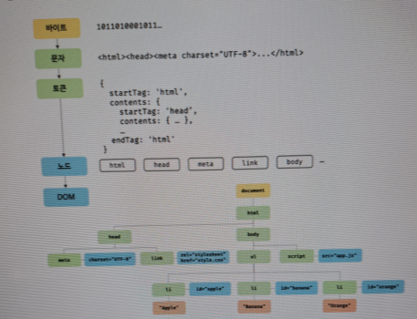

# 38. 브라우저의 렌더링 과정

> 대부분의 프로그래밍 언어는 운영체제나 가상 머신 위에서 실행되지만 웹 어플리케이션의 클라이언트 사이드 자바스크립트는
> 브라우저에서 HTML, CSS 와 함께 실행된다. 따라서 브라우저 환경을 고려할 때 더 효율적인 클라이언트 사이드 자바스클비트 프로그래밍이 가능하다.

1. 파싱은 프로그래밍 언어의 문법에 맞게 작성된 텍스트 문서를 읽어 들여 실행하기 위한 텍스트 문서의 문자열을 토큰으로 분해하여
토큰에 문법적 의미와 구조를 반영하여 트리 구조의 자료구조인 파스 트리를 생성하는 일련의 과정을 말한다. 
일반적으로 파싱이 완료된 이후에는 파스 트리를 기반으로 중간 언어인 바이트코드를 생성하고 실행한다.
2. 렌더링은 HTML CSS 자바스크립트로 작성된 문서를 파싱하여 브라우저에 시각적으로 출력하는 것을 말한다.

브라우저는 다음과 같은 과정을 거쳐 렌더링을 수행한다.

1. 브라우저는 HTML, CSS, 자바스크립트, 이미지, 폰트, 파일 등 렌더링에 필요한 리소스를 요청하고 서버로부터 응답을 받는다.
2. 브라우저의 렌더링 엔진은 서버로부터 응답된 HTML과 CSS를 파싱하여 CSSOM을 생성하고 이들을 결합하여 렌더 트리를 생성한다.
3. 브라우저의 자바스크립트 엔진은 서보로부터 응답된 자바스크립트를 파싱하여 AST를 생성하고 바이트코드로 변환하여 실행한다.
4. 이때 자바스크립트는 DOM API를 통해 DOM이나 CSSOM을 변경할 수 있다. 변경된 DOM과 CSSOM은 다시 렌더 트리로 결합된다.
5. 렌더 트리를 기반으로 HTML 요소의 레이아웃을 계산하고 브라우저 화면에 HTML 요소를 페인팅한다.

## 38.1 요청과 응답

> 브라우저의 핵심 기능은 필요한 리소스를 서버에 요청하고 응답받아 브라우저에 시각적으로 렌더링하는 것이다.
> 렌더링에 필요한 리소스는 모두 서버에 존재하므로 필요한 리소르를 서버에 요청하고 서버가 응답한 리소스를 파싱하여 렌더링하는 것이다.

> 서버에 요청을 전송하기 위해 브라우저는 주소창을 제공한다. 브라우저의 주소창에 URL을 입력하고 엔터키를 누르면 URL 호스트 이름이 DNS를 통해 IP 주소로 변환되고 
> IP 주소를 갖는 서버에게 요청을 전송한다.

> 브라우저 주소창에 https://poemaweb.com 을 입력하고 엔터 키를 누르면
> 루트 요청이 poiemawab.com 으로 전송된다. 루트 요청에는 명확히 리소스를 요청하는 내용이 없지만
> 일반적으로 index.html 을 응답하도록 기본 설정되어 있다.

> 서버는 루트 요청에 대해 서버의 루트 폴더에 존재하는 정적 파일 index.html 을 클라이언트로 응답한다.
> index.html 이 아닌 다른 정적 파일을 서버에 요청하려면 브라우저의 주소창에 https://poiemaweb.com/assets/data/data.json 와 같이 요청할 정적 파일의 경로와
> 파일 이름을 URI 의 호스트 뒤에 패스에 기술하여 서버에 요청한다.

> 실제로 브라우저에 주소를 치고 들어갔을 때 나오는 요청과 응답을 보면
> CSS, 자바스크립트 이미지 폰트 파일들도 응답이 된것을 확인할 수 있다.

## 38.2 HTTP 1.1 과 HTTP 2.0

> Http 는 웹에서 브라우저와 서버가 통신하기 위한 프로토콜이다.
> HTTP 1.1 은 기본적으로 커넥션 당 한아ㅢ 요청과 응답만 처리한다.
> CSS, image, js, 태그 등의 리소스 요청이 개별적으로 전송되고 응답 또한 개별적으로 전송된다.
> 동시 전송이 불가능 한 구조이므로 요청할 리소스의 개수에 비례하여 응답 시간도 증가하는 단점이 있다.

> HTTP/2 는 커넥션당 여러 개의 요청과 응답 다중 요청 / 응답이 가능하다.
> HTTP/1.1 에 비해 페이지 로드 속도가 약 50% 빠르다고 알려져 있다.

## 38.3 HTML 파싱과 DOM 생성

> 브라우저의 요청에 의해 서버가 응답한 HTML 문서는 문자열로 이루어진 순수한 텍스트다. 순수한 텍스트인 HTML 문서를 브라우저에 시각적인 픽셀로 렌더링하려면 HTML 문서를 브라우저가 이해할 수 있는 자료구조로 변환하여 메모리에 저장해야 한다.

> HTML 문서를 파싱하여 브라우저가 이해할 수 있는 자료구조인 DOM 을 생성한다.



1. 서버에 존재하던 HTML 파일이 브라우저의 요청에 의해 응답된다. 서버는 브라우저가 요청한 HTML 파일을 읽어 들여 메모리에 저장한 뒤 바이트를 인터넷에 경유하여 응답한다.
2. 브라우저는 서버가 응답한 HTML 문서를 바이트 형태로 응답받고 UTF-8 기준으로 문자열로 반환된다.
meta 태그의 charset 어트리뷰트에 선언된 인코딩 방식은 content-type: text/html; charset-utf-8 와 같이 응답 헤더에 담겨 응답된다.
3. 문자열로 변환된 HTML 문서를 읽어 문법적 의미를 갖는 코드의 최소 단위인 토큰들로 분해한다.
4. 각 토큰들을 객체로 변환하여 노드들을 생성한다. 문서 노드 요소 노드 어트리뷰트 노트 텍스트 노드 등이 생성된다. 노드는 DOM을 구성하는 기본 요소가 된다.
5. HTML 문서는 HTML 요소들의 집합으로 이루어지며 HTML 요소는 중첩 관계를 갖는다.
즉 HTML 요소의 콘텐츠 영역에는 텍스트뿐만 아니라 다른 HTMl 요소도 포함될 수 있다.
이때 HTML 요소 간에는 중첩 관계에 의해 부자 관계가 형성된다. 이러한 부자 관계를 반영하여 모든 노드들을 트리 자료구조라고 부른다.
이 노드들로 구성된 트리 자료구조를 DOM 이라 부른다.

## 38.4 CSS 파싱과 CSSOM 생성

> 렌더링 엔진은 HTML을 처음부터 한 줄씩 순차적으로 파싱하여 DOM을 생성해 나간다.
> 이처럼 렌더링엔진은 DOM을 생성해 나가다가 CSS를 로드하는 link 태그나 style 태그를 만나면 DOM 생성을 이시 중단한다.

> link 태그의 href 어트리뷰트에 지정된 CSS 파일을 서버에 요청하여 로드한 CSS 파일이나 style 태그 내의 CSS를 HTML과 동일한 파싱 과정을 거치며 CSSOM 을 생성한다.
> CSS 파싱이 완료되면 HTML 파싱이 중단된 지점부터 다시 HTML을 파싱하여 DOM 생성을 재개한다.

## 38.5 렌더 트리 생성

> 렌더링 엔진은 서버로부터 응답된 HTML 과 CSS 를 파싱하여 각각 DOM, CSSOM 을 생성한다. 렌더링을 위해 렌더 트리로 결합된다.

> 렌더 트리는 렌더링을 위한 트리 구조의 자료구조다. 브라우저 화면에 렌더링되지 않는 노드와 CSS 에 의해 비표시되는 노드들은 포함하지 않는다.

> 이후 완성된 렌더 트리는 각 HTML 요소의 레이아웃을 계산하는 데 사용되며 브라우저 화면에 픽셀을 렌더링하는 페인팅 처리에 입력된다.

> 지금까지 살펴본 브라우저의 렌더링 과정은 반복해서 실행할 수 있다. 다음과 같은 경우 반복해서 레이아웃 계산과 페인팅이 재차 실행된다.

1. 자바스크립트에 의한 노드 추가 또는 삭제
2. 브라우저 창의 리사이징에 의한 뷰포트 크기 변경
3. HTML 요소의 레이아웃에 변경을 발생시키는 등의 스타일 변경

> 레이아웃 계산과 페인팅을 다시 실행하는 리렌더링은 비용이 많이 드는 성능에 악영향을 주는 작업이다.
> 가급적 리렌더링이 빈번하게 일어나지 않도록 주의할 필요가 있다.

## 38.6 자바스크립트 파싱과 실행

> HTMl 문서를 파싱한 결과물로서 생성된 DOM 은 HTML 문서의 구조와 정보뿐만 아니라 HTML 요소와 스타일 등을 변경할 수 있는 프로그래밍 인터페이스 DOM API 를 제공한다.
> 자바스크립트 코드에서 DOM API 를 사용하면 이미 생성된 DOM 을 동적으로 조작할 수 있다.

> CSS 파싱 과정과 마찬가지로 렌더링 엔진은 HTML을 한 줄씩 순차적으로 파싱하며 DOM을 생성해 나가다가 자바스크립트 파일을 로드하는 script 태그나 자바스크립트 코드를 콘텐츠로 담은 script
> 태그를 만나면 일시 중단한다.

> script 태그의 src 어트리뷰트에 정의된 자바스크립트 파일을 서버에 요청하여 로드한 자바스크립트 파일이나
> script 태그 내의 자바스크립트 코드를 파싱하기 위해 자바스크립트 엔진에 제어권을 넘긴다.
> 이후 자바스크립트 파싱과 실행이 종료되면 다시 제어권을 넘겨 중단된 지점부터 다시 파싱하여 DOM 생성을 재개한다.

> 자바스크립트 파싱과 실행은 브라우저의 렌더링 엔진이 아닌 자바스크립트 엔진이 처리한다.
> 코드를 파싱하여 CPU 가 이해할 수 있는 저수준 언어로 변환하고 실행하는 역할을 한다.

> 렌더링 엔진으로부터 제어권을 넘겨받은 자바스크립트 엔진은 자바스크립트 코드를 파싱하기 시작한다.
> 렌더링 엔진이 HTML과 CSS 를 파싱하여 DOM과 CSSOM을 생성하듯이 자바스크립트를 해석하여
> AST (추장석 구문 트리) 를 생성한다. 인터프리터가 실핼 할 수 있는 중간 코드인 바이트코드를 생성하여 실행한다.

> AST 기반으로 인터프리터가 실행할 수 있는 중간 코드인 바이트코드를 생성하여 실행한다.


### 토크나이징

> 단순한 문자열인 자바스크립트 소스코드를 어휘 분석하여 문법적 의미를 갖는 코드의 최소 단위인 토큰드로 분해한다. 이 과정을 렉싱ㅇ라고 부르기도 하지만 미묘한 차이가 있다.

### 파싱

> 토큰들의 집합을 구문 분석하여 AST를 생성한다. AST는 토큰에 문법적 의미와 구조를 반영한 트리 구조의 자료구조이다.
> AST를 사용하면 Typescript, Babel, Prettier 같은 트랜스파일러를 구현할 수도 있다.

### 바이트코드 생성과 실핼

> 파싱의 결과물로서 생성된 AST는 인터프리터가 실해할 수 있는 중간 코드인 바이트코드로 변환되고
> 인터프리터에 의해 실행된다.

## 38.7 리플로우와 리페인팅

> 만약 자바스크립트 코드에 DOM이나 CSSOM 을 변경하는 DOM API 가 사용된 경우 DOM 이나 CSSOM 이 변경된다.
> 이때 변경된 DOM, CSSOM 은 다시 렌더 트리로 결합되고 렌더 트리를 기반으로 레이아웃과 페인트 과정을 거쳐 브라우저 화면에 다시 렌더링한다.
> 이를 리플로우 리페인트 라고 한다.

> 리플로우는 레이아웃 계산을 다시 하는 것을 말하며 노드 추가 삭제, 요소의 크기 / 위치 변경,
> 윈도우 리사이징 등 레이아웃에 영향을 주는 변경이 발생한 경우에 한하여 실행된다.

> 리페인트는 재결합된 렌더 트리를 기반으로 다시 페인트를 하는 것을 말한다.

## 38.8 자바스크립트 파싱에 의한 HTML 파싱 중단

생략

## 38.9 script 태그의 async/defer 어트리뷰트

> 자바스크립트 파싱에 의한 DOM 생성이 중단되는 문제를 해결하기 위해
> async와 defer 어트리뷰트가 추가되었다.

> src 어트리뷰트를 통해 외부 자바스크립트 파일을 로드하는 경우에만 사용할 수 있다.
> src 어트리뷰트가 없는 인라인 자바스크립트에는 사용할 수 없다.

```javascript
<script async src={"extern.js"}></script>
<script defer src={"extern.js"}></script>
```

### async 어트리뷰트

> HTML 파싱과 외부 자바스크립트 파일의 로드가 비동기적으로 동시에 진행된다.
> 단 자바스크립트의 파싱과 실행은 자바스크립트 파일의 로드가 완료된 직후 진행되며 파싱이 중단된다. 

### defer 어트리뷰트

> HTML 파시방과 외부 자바스크립트 파일의 로드가 비동기적으로 동시에 진행된다.
> 단 완료 직후 DOM 생성이 완료된 직후 진행된다.

---


- [ ] https://google.com 을 검색했을 때는 어떤 일이 일어나는가.
- 