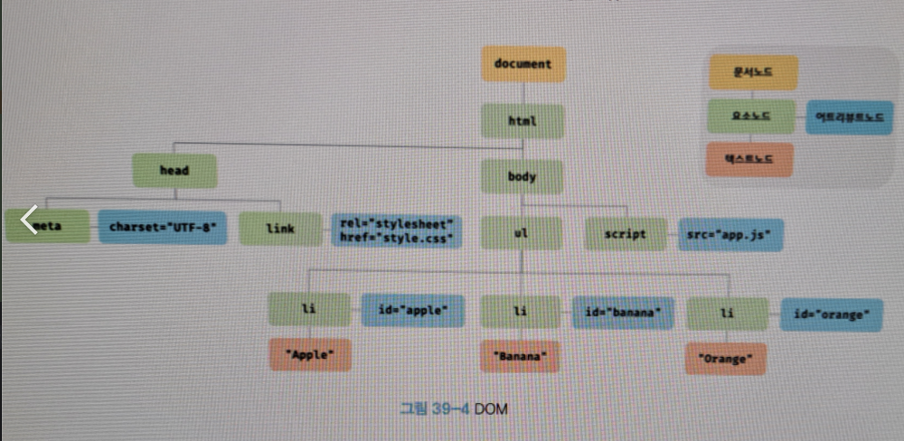

# 39. DOM

> DOM 은 HTML 문서의 계층적 구조와 정보를 표현하며 이를 제어할 수 있는 API
> 프로퍼티와 메서드를 제공하는 트리 자료구조다.

## 39.1 노드

> HTML 요소는 HTML 문서를 구성하는 개별적인 요소를 의미한다.

> `<div class="greeting">Hello</div>` 시작태그, 어트리뷰트 이름, 어트리뷰트 값, 콘텐츠, 종료 태그 로 이루어져있다.

> HTML 문서는 HTML 요소들의 집합으로 이뤄지며, HTML 요소는 중첩 관계를 갖는다.
> HTML 요소으 콘텐츠 영역에는 텍스트뿐만 아니라 다른 HTML 요소도 포함할 수 있다.

> 이때 HTML 요소 간에는 중첩 관계에 의해 계층적인 부자 관계(트리 구조)가 형성된다.

### 트리 자료구조

> 트리 자료구조는 노드들의 계층 구조로 이뤄진다. 트리 자료구조는 부모 노드의 자식 노드로 구성되어
> 노드 간의 계층적 구조를 표현하는 비선형 자료구조를 말한다. 트리 자료구조는 하나의 최상위 노드에서 시작한다.

> 최상위 노드는 부모 노드가 없으며 루트 노드라 한다. 루트 노드는 0개 이상의 자식 노드를 갖는다.
> 자식 노드가 없는 로드는 리프 노드라 한다.

> 노드 객체들로 구성된 트리 자료구조를 DOM 이라 한다.

### 39.1.2 노드 객체의 타입

```html
<!DOCTYPE html>
<html>
<head>
    <meta charset="UTF-8">
    <link rel="stylesheet" href="style.css">
</head>
<body>
<ul>
    <li id="apple">Apple</li>
    <li id="banana">Banana</li>
    <li id="orange">Orange</li>
</ul>
</body>
</html>
```



> 이처럼 DOM은 노드 객체의 계층적인 구조로 구성된다.

### 문서 노드

> 문서 노드는 DOM 트리의 최상위에 존재하는 루트 노드로서 document 객체를 가리킨다.
> document 객체는 브라우저가 렌더링한 HTML 문서 전체를 가리키는 객체로서 전역 객체 window 의 document 프로퍼티에 바인딩되어 있다.
> 따라서 문서 노드는 window.document 또는 document 로 참조할 수 있다.

> 브라우저 환경의 모든 자바스크립트 코드는 script 코드에 의해 분리되어 있어도 하나의 전역 객체 window 를 공유한다.
> 따라서 모든 자바스크립트 코드는 전역 객체 window의 document 프로퍼티에 바인딩 되어 있는 하나의 document 객체를 바라본다.
> 즉 HTML 문서당 document 객체는 유일하다.

> DOM 트리의 노드들에 접근하기 위한 진입점 역할을 담당한다.

### 요소 노드

> 요소 노드는 HTML 요소를 가리키는 객체다. 부자 관계를 가지며 이 부자 관계를 통해 정보를 구조화한다.

### 어트리뷰트 노드

> 어트리뷰트 노드는 HTML 요소의 어트리뷰트를 가리키는 객체다. 어트리뷰트 노드는 어트리뷰트가 지정된 HTML 요소의 요소 노드와 연결되어 있다.
> 단 요소 노드는 부모 노드와 연결되어 있지만 어트리뷰트 노드는 부모 노드와 연결되어 있지 않고 요소 노드에만 연결되어 있다.

> 어트리뷰트 노드는 부모 노드가 없으므로 요소 노드의 형제 노드는 아니다.

### 텍스트 노드

> 텍스트 노드는 HTML 요소의 어트리뷰트를 가리키는 객체다. 요소 노드가 문서의 구조를 표현한다면 텍스트 노드는 문서의 정보를 표현한다.
> 요소 노드의 자식 노드이며 자식 노드를 가질 수 없는 리프 노드다.

---
> 위 4가지 노드 타입 외에도 주석을 위한 Comment 노드, DocumentType 노드, DocumentFragment 노드 등 총 12개의 노드가 있다.

### 39.1.3 노드 객체의 상속 구조

> DOM은 HTML 문서의 계층적 구조와 정보를 표현하며 이를 제어할 수 있는 API 프로퍼티와 메서드를 제공하는 트리 자료구조라 하였다.
> DOM을 구성하는 노드 객체는 ECMAScript 표준 빌트인 객체가 아니라 브라우저 한경에서 추가적으로 제공하는 호스트 객체다. 하지만 노드 객체도 자바스크립트 객체이므로
> 프로토타입에 의한 상속 구조를 갖는다.

> 요소 노드는 Element 인터페이스를 상속받는다. 태그의 종류별로 세분화된 HTMLHtmlElement, HTMLHeadElement 등의 인터페이스를 상속받는다.

> 프로토타입 체인 관점에서 살펴보아 input 요소를 파싱하여 객체화한 input 요소 노드 객체는 HTMLInputElement, HTMLElement, Element, Node, EventTarget,
> Objectdml
> prototype 에 바인딩되어 있는 프로토타입 객체를 상속받는다.

> input 은 프로토타입 체인에 있는 모든 프로토타입의 프로퍼티나 메서드를 상속받아 사용할 수 있다.

| input 요소 노드 객체의 특성                 | 프로토타입을 제공하는 객체   |
|------------------------------------|------------------|
| 객체                                 | Object           |
| 이벤트를 발생시키는 객체                      | EventTarget      |
| 트리 자료구조의 노드 객체                     | Node             |
| 브라우저가 렌더링 할 수 있는 웹 문서의 요소를 표현하는 객체 | Element          |
| 웹 문서의 요소 중에서 HTML 요소를 표현하는 객체      | HTMLElement      |
| HTML 요소 중에서 input 요소를 표현하는 객체      | HTMLInputElement |

> 노드 객체에는 노드 객체의 종류 노드 타입에 상관없이 모든 노드가 객체가 공통으로 갖는 기능도 있고
> 노드 타입에 따라 고유한 기능도 있다. 모든 노드 객체는 공통적으로 이벤틀르 발생시킬 수 있다.
> 이벤트에 관련된 기능은 EventTarget 인터페이스가 제공한다. 모든 노드 객체는 트리 자료구조의 노드로서 공통적으로
> 트리 탐색 기능이나 노드 정보 제공 기능이 필요하다 이러한 기능은 Node 인터페이스가 제공한다.

> HTML 요소가 객체화된 요소 노드 객체는 HTML 요소가 갖는 공통적인 기능이 있다. 예를 들어 input 요소 노드 객체와
> div 요소 노드 객체는 모두 HTML 요소의 스타일을 나타내는 style 프로퍼티가 있다.
> HTMLElement 인터페이스가 제공한다.

> 하지만 요소 노드 객체는 HTML 요소의 종류에 따라 고유한 기능도 있다.

> DOM은 HTML 문서의 계층적 구조와 정보를 표현하는 것은 물론 노드 객체이 종류 노드 타입에 따라 필요한 기능을
> 프로퍼티와 메서드의 집합인 DOM API 로 제공한다. HTML 구조나 내용 또는 스타일 등을 동적으로 조작할 수 있다.

## 39.2 요소 노드 취득

> HTML 구조나 내용 또는 스타일 등을 동적으로 조작하려면 먼저 요소 노드를 취득해야 한다.
> 텍스트 노드는 요소 노드의 자식 노드이고, 어트리뷰트 노드는 요소 노드와 연결되어 있기 때문에 텍스트 노드나 어트리뷰트 노드를 조작하고자 할 때도 마찬가지다.

> h1 요소의 텍스트를 변경하고 싶은 경우에는 DOM 트리 내에 존재하는 h1 요소 노드를 취득할 필요가 있다.
> 취득한 요소 노드의 자식 노드인 텍스트 노드를 변경하면 h1 요소의 텍스트가 변경된다.

## 39.2.1 id를 이용한 요소 노드 취득

> Document.prototype.getElementById 메서드는 인수로 전달한 id 어트리뷰트 값을 갖는 하나의 요소 노드를 탐색하여 반환한다.
> getElementById 메서드는 Document.prototype 프로퍼티다. 반드시 문서 노드인 document 를 통해 호출해야 한다.

> HTML 문서 내에는 중복된 id 값을 갖는 요소가 여러 개 존재할 가능서이 있다.
> 이러한 경우 getElementById 메서드는 인수로 전달된 id 값을 닺는 첫 번째 요소 노드만 반환한다.
> 즉 getElementById 메서드는 언제나 단 하나의 요소 노드를 반환한다.

> 만약 인수로 전달된 id 값을 갖는 요소가 없을 경우 null 을 반환한다.

> HTML 요소에 id 어트리뷰트를 부여하면 id 값과 동일한 전역 변수가 암묵적으로 선언되고 해당 노드 객체가 할당되는 부수 효과가 있다.

> 단 id 값과 동일한 이름의 전역 변수가 이미 선언되어 있으면 이 전역 변수에 노드 객체가 재할당되지 않는다.

### 39.2.2 태그 이름을 사용한 요소 노드 취득

> getElementByTagName 메서드는 인수로 전달한 태그 이름을 갖는 모든 요소 노드들을 탐색하여 반환한다. 메서드 이름에 포함된 Elements 가 복수형인 것에서 알 수 있듯이
> 여러 개의 요소 노드 객체를 갖는 DOM 컬렉션 객체 HTMLCollection 객체를 반환한다.

### 39.2.3 class 를 이용한 요소 노드 취득

> getElementsByClassName 메서드는 인수로 전달한 class 어트리뷰트 값을 갖는 모든 요소 노드들을 탐색하여 반환한다.

> getElementsByClassName 메서드는 DOM 루트 노드인 문서 노드 즉 document 를 통해 호출하며 DOM 전체에서 요소 노드를 탐색하여 반환하고 getElementsByClassName
> 메서드는 특정 요소 노드를 통해 호출하며
> 특정 요소 노드의 자손 노드 중에서 요소 노드를 탐색하여 반환한다.

### 39.2.4 CSS 선택지를 이용한 요소 노드 취득

> CSS 선택자는 스타일을 적용하고자 하는 HTML 요소를 특정할 때 사용하는 문법이다.
> querySelector 메서드는 인수로 전달한 CSS 선택자를 만족시키는 하나의 요소 노드를 탐색하여 반환한다.

1. 인수로 전달한 CSS 선택자를 만족시키는 요소 노드가 여러 개인 경우 첫 번쨰 요소 노드만 반환
2. 인수로 전달된 CSS 선택자를 만족시키는 요소 노드가 없을 경우 null 을 반환
3. 인수로 전달한 CSS 선택자가 문법에 맞지 않은 경우 DOMException 에러가 발생한다.

> querySelectorAll 메서드는 전달한 CSS 선택자를 만족시키는 모든 요소 노드를 탐색하여 반환한다.

### 39.2.5 특정 요소 노드를 취득할 수 있는지 확인

> matches 메서드는 인수로 전달한 CSS 선택자를 통해 특정 요소 노드를 취득할 수 있는지 확인한다.

> matches 메서드는 이벤트위임을 사용할 때 유용하다.

### 39.2.6 HTMLCollection과 NodeList

> DOM 컬렉션 객체인 HTMLCollection 과 NodeList 는 DOM API 가 여러 개의 결과값을 반환하기 위한 DOM 컬렉션 객체다.
> HTMLCollection 과 NodeList 는 모두 유사 배열 객체이면서 이터러블이다. 스프레드 문법을 사용하여 간단히 배열을 변환 가능하다.

> 노드 객체의 상태 변화를 실시간으로 반영하는 살아 있는 객체이다. HTMLCollection 은 언제나 live 객체로 동작한다.
> NodeList는 대부분의 경우 노드 객체의 상태 변화를 실시간으로 반영하지 않고 과거의 정적 상태를 유지하는 non-live 객체로 동작하지만 경우에 따라 live 객체로 동작할 때가 있다.

### HTMLCollection

> getElementsByTagName, getElementsByClassName 메서드가 반환하는 HTMLCollection 객체는 노드 객체의 상태 변화를
> 실시간으로 반영하는 살아있는 DOM 컬렉션 객체다.

### NodeList

> HTMLCollection 객체의 부작용을 해결하기 위해 getElementsByTagName,getElementsByClassName 메서드 대신 querySelectorAll 메서드를 사용하는 방법도 있다.
> querySelectorAll 메서드는 NodeList 객체를 반환한다. 이때 NodeList 객체는 상태 변경을 반영하지 않는 객체다.

> NodeList 객체는 대부분의 경우 노드 객체의 상태 변경을 실시간으로 반영하지 않고 과거의 정적 상태를 유지하는 non-live 상태다.
> 하지만 childNodes 프로퍼티가 반환하는 NodeList 객체는 HTMLCollection 객체와 마찬가지로 실시간으로 동작한다.

> 노드 객체의 상태 변경과 상관없이 안전하게 DOM 컬렉션을 사용하려면 HTMLCollection, NodeList 객체를 배열로 변홚여 사용하는 것을 권장한다.

## 39.3 노드 탐색

> 요소 노드를 취득한 다음 취득한 요소 노드를 기점으로 DOM 트리의 노드를 옮겨 다니며 부모 형제 자식 노드 등을 탐색 해야 할 때가 있다.

```html

<ul id="f">
    <li class="apple">Apple</li>
    <li class="banana">Banana</li>
    <li class="orange">Orange</li>
</ul>
```

> ul#f 요소는 3개의 자식 요소를 갖는다. 이때 먼저 ul#f 요소 노드를 취득한 다음 자식 노드를 모두 탐색하거나
> 자식 노드 중 하나만 탐색 가능하다. banana 요소는 2개의 형제 요소와 부모 요소를 갖는다.

> DOM 트리 상의 노드를 탐색할 수 있도록 Node, Element 인터페이스는 트리 탐색 프로퍼티를 제공한다.

> parentNode, previousSibling, firstChild, childNodes 프로퍼티는 Node.prototype 이 제공하고
> previousElementSibling, nextElementSibling 프로퍼티는 Element prototype 이 제공한다.

> 노드 탐색 프로퍼티는 전부 getter 만 존재한다.

### 39.3.1 공백 텍스트 노드

> HTML 요소 사이에 스페이스, 탭, 줄바꿈 등의 공백 문자는 텍스트 노드를 생성한다. 이를 공백 텍스트 노드라 한다.

### 39.3.2 자식 노드 탐색

| 프로퍼티                                | 설명                                                                                                                    |
|-------------------------------------|-----------------------------------------------------------------------------------------------------------------------|
| Node.prototype.childNodes           | 자식 노드를 모두 탐색하여 DOM 컬렉션 객체인 NodeList에 담아 반환한다. childNodes 프로파티가 반환한 NodeList 에는 요소 노드 뿐만 아니라 텍스트 노드도 포함되어 있을 수 있다.     |
| Element.prototype.children          | 자식 노드 중에서 요소 노드만 모두 탐색하여 DOM 컬렉션 객체인 HTMLCOllection 에 담아 반환한다. children 프로퍼티가 반환한 HTMLCollection 에는 텍스트 노드가 포함되지 않는다. |
| Node.prototype.firstChild           | 첫 번째 자식 노드를 반환한다. 텍스트 노드거나 요소 노드다.                                                                                    |
| Node.prototype.lastChild            | 마지막 자식 노드를 반환한다, 텍스트 노드거나 요소 노드다.                                                                                     |
| Element.prototype.firstElementChild | 첫 번째 자식 요소를 반환한다. 요소 노드만 반환한다.                                                                                        |
| Element.prototype.lastElementChild  | 마지막 자식 요소를 반환한다. 요소 노드만 반환한다.                                                                                         |

### 39.3.3 자식 노드 존재 확인

> 자식 노드가 존재하는지 확인하려면 hasChildNodes 메서드를 사용하며 Boolean 값을 반환한다.

> 텍스트 노드를 포함하여 자식 노드의 존재를 확인한다.

### 39.3.4 요소 노드의 텍스트 노드 탐색

> 요소 노드의 텍스트 노드는 요소 노드의 자식 노드다. 따라서 요소 노드의 텍스트 노드는 firstChild 프로퍼티로 접근할 수 있다.

### 39.3.5 부모 노드 탐색

> 부모 노드를 탐색하려면 Node.prototype.parentNode 프로퍼티를 사용한다.
> 텍스트 노드는 DOM 트리의 최종단 노드인 리프 노드 이므로 부모 노드가 텍스트 노드일 수는 없다.

### 39.3.6 형제 노드 탐색

| 프로퍼티                                     | 설명                                                                       |
|------------------------------------------|--------------------------------------------------------------------------|
| Node.prototype.previousSibling           | 부모 노드가 같은 형제 노드 중에서 자신의 이전 형제 노드를 탐색하여 반환한다. 요소 노드 뿐만 아니라 텍스트 노드일 수도 있다. |
| Node.prototype.nextSibling               | 부모 노드가 같은 형제 노드 중에서 자신의 다음 형제 노드를 탐색하여 반환한다. 요소 노드 뿐만 아니라 텍스트 노드일 수도 있다. |
| Element.prototype.previousElementSibling | 부모 노드가 같은 형제 노드 중에서 자신의 이전 형제 요소 노드를 탐색한다.                               |
| Element.prototype.nextElementSibling     | 부모 노드가 같은 형제 노드 중에서 자신의 다음 형제 요소 노드를 탐색한다.                               |

## 39.4 노드 정보 취득

Node.prototype.nodeType
- 노드 객체의 종류, 즉 노드 타입을 나타내는 상수를 반환한다. 노드 타입 상수는 Node에 정의되어 있다.
    - Node.ELEMENT_NODE : 요소 노드 타입을 나타내는 상수 1을 반환
    - Node.TEXT_NODE : 텍스트 노드 타입을 나타내는 상수 3을 반환
    - Node.DOCUMENT_NODE : 문서 노드 타입을 나타내는 상수 9를 반환

Node.prototype.nodeName
- 노드의 이름을 문자열로 반환한다.
    - 요소 노드 : 대문자 문자열로 태그 이름("UL", "LI" 등)을 반환
    - 텍스트 노드 : 문자열 "#text"를 반환
    - 문서 노드 : "#document"를 반환

## 39.5 요소 노드의 텍스트 조작

### 39.5.1 nodeValue

> nodeValue 는 setter getter 모두 존재하는 접근자 프로퍼티다. 참조와 할당 모두 가능하다.

```html
<html>
    <body>
        <div id="foo">hello</div>
        <script>
            console.log(document.nodeValue); // null
            const $foo = document.getElementById('foo');
            console.log($foo.nodeValue); // null
            const $textNode = $foo.firstChild;
            console.log($textNode.nodeValue); // hello
            $textNode.nodeValue = 'World'
            console.log($textNode.nodeValue); // World
        </script>
    </body>
</html>
```

### 39.5.2 textContent

> textContent 프로퍼티는 setter getter 모두 존재하는 접근자 프로퍼티이다.
> 요소 노드의 텍스트와 모든 자손 노드의 텍스트를 모두 취득하거나 변경한다.

```html
<html>
    <body>
        <div id="foo">hello<span>world</span></div>
        <script>
            console.log(document.getElementById('foo').textContent); // hello world
        </script>
    </body>
</html>
```

> 텍스트 노드의 nodeValue 프로퍼티를 참조할 때만 텍스트 노드의 값 텍스트를 반환한다. nodeValue 프로퍼티를 사용하면 textContent 프로퍼티를 사용할 때와 비교해서 복잡하다.

> textContent 프로퍼티와 유사한 동작을 하는 innerText 프로퍼티가 있다. innerText 프로퍼티는 다음과 같은 이유로 사용하지 않는 것이 좋다.

1. innerText 프로퍼티는 CSS에 순종적이다. visibility: hidden 같은 경우에는 요소 노드의 텍스트를 반환하지 않는다,
2. css 를 고려하다 보니 속도가 느리다.

## 39.6 DOM 조작

> DOM 조작은 새로운 노드를 생성하여 DOM 에 추가하거나 기존 노드를 삭제 또는 교체하는 것을 말한다.
> 노드가 추가되거나 삭제되면 리플로우와 리페인트가 발생한다.

### 39.6.1 innerHTML

> innerHTML 프로퍼티는 setter 와 getter 모두 존재하는 접근자 프로퍼티로서 요소 노드의 HTML 마크업을 취득하거나 변경한다.
> 요소 노드의 innerHTML 프로퍼티를 참조하면 요소 노드의 콘텐츠 영역 내에 포함된 모든 HTML 마크업을 문자열로 반환한다.

```html
<html>
    <body>
        <div id="foo">hello<span>world</span></div>
        <script>
            console.log(document.getElementById('foo').innerHTML);
            // hello<span>world</span>
        </script>
    </body>
</html>
```

> 요소 노드의 innerHTML 프로퍼티에 할당한 HTML 마크업 문자열은 렌더링 엔진에 의해 파싱되어 요소 노드의 자식으로 DOM에 반영된다.
> 이때 사용자로부터 입력받은 데이터를 그대로 innerHTML 프로퍼티에 할당하는 것은 크로스 사이트 스크립팅 공격 (XSS) 에 취약하므로 위험하다.

> innerHTML 프로퍼티의 또 다른 단점은 요소 노드의 innerHTML 프로퍼티에 HTML 마크업 문자열을 할당하는 경우
> 요소 노드의 모든 자식 노드를 제거하고 할당한 HTML 마크업 문자열을 파싱하여 DOM을 변경한다는 것이다.

> 효율적이지 않다.

> innerHTML 프로퍼티는 새로운 요소를 삽입할 때 삽입할 위치를 지정할 수 없다.

### 39.6.2 insertAdjacentHTML 메서드

> insertAdjacentHTML 메서드는 기존 요소를 제거하지 않으면서 위치를 지정해 새로운 요소를 삽입한다.

> insertAdjacentHTML 메서드는 두 번쨰 인수로 전달한 HTML 마크업 문자열을 파싱하고 첫 번쨰 인수로 전달한 위치에 사입하여 DOM 에 반영한다.
> 첫 번째 인수로 전달할 수 있는 문자열은 beforebegin, afterbegin, beforeend, afterend 4 가지다.

> innerHTML 보다 효울적이고 빠르다. 하지만 스크립트 공격에 취약하다는 점은 동일하다.

### 39.6.3 노드 생성과 추가

> DOM 은 노드를 직접 생성 삽입 삭제 치환하는 메서드도 제공한다.

### 요소 노드 생성

> createElement 메서드는 요소 노드를 생성하여 반환한다. createElement 메서드는 매개변수 tagName 이름에는 태그 이름을 나타내는 문자열을 인수로 전달한다.

> 생성한 요소 노드는 기존 DOM 에 추가되지 않고 홀로 존재하는 상태다. 즉 createElement 메서드는 요소 노드를 생성할 뿐 DOM 에 추가하지는 않는다.
> 따라서 이후에 생성된 요소 노드를 DOM 에 추가하는 처리가 별도로 필요하다.

### 텍스트 노드 생성

> createTextNode 메서드는 텍스트 노드를 생성하여 반환한다.

```javascript
const textNode = document.createTextNode('Banana');
```

> 텍스트 노드는 요소 노드의 자식 노드다. 하지만 createTextNode 메서드로 생성한 텍스트 노드는 요소 노드의 자식 노드로 추가되지 않고
> 홀로 존재하는 상태다. 즉 createElement 메서드와 마찬가지로 createTextNode 메서드는 텍스트 노드를 생성할 뿐 요소 노드에 추가하지는 않는다.

### 텍스트 노드르 요소 노드의 자식 노드로 추가

> appendChild 메서드는 매개변수 childNode 에게 인수로 전달한 노드를 appendCHild 메서드를 호출한 노드의 마지막 자식 노드로 추가한다.

```javascript
$li.appendChild(textNode);
```

> 요소 노드와 텍스트 노드는 부자 관계로 연결되었지만 DOM 에는 추가되어있지 않다.

### 요소 노드를 DOM에 추가

> appendChild 메서드를 사용하여 텍스트 노드와 부자 관계로 연결한 요소 노드를 마지막 자식 요소로 추가한다.

### 39.6.4 복수의 노드 생성과 추가

> 컨테이너 요소를 사용하면 여러번 리페인트와 리플로우를 발생시키지 않아도 된다.

```js
const $fruits = document.getElementById('fruits');
const $container = document.createElement('div');
['apple','banana','orange'].forEach(text => {
	const $li = document.createElement('li');
	const textNode = document.createTextElement(text);
	$li.appendChild(textNode);
	$container.appendChild($li);
})
$fruits.appendChild($container);
```

> 하지만 불필요한 div 가 생성되어 바람직하지 않다.

> Document.prototype.createDocumentFragment 메서드는 비어 있는 DocumentFragment 노드를 생성하여 반환한다.

```js
const $fruits = document.getElementById('fruits');
const $fragment = document.createDocumentFragment();
['apple','banana','orange'].forEach(text => {
	const $li = document.createElement('li');
	const textNode = document.createTextElement(text);
	$li.appendChild(textNode);
	$fragment.appendChild($li);
})
$fragment.appendChild($container);
```

> DOM 변경이 발생하는 것은 한 번 뿐이다. 여러 개의 요소 노드를 추가할 경우 createDocumentFragment 노드를 사용하는 편이 좋다.

### 39.6.5 노드 삽입 

### 마지막 노드로 추가

> appendChild 메서드는 인수로 전달받은 노드를 자신을 호출한 노드의 마지막 자식 노드로 DOM에 추가한다.

### 지정한 위치에 노드 삽입

> insertBefore(newNode, childNode) 메서드는 첫 번째 인수로 전달받은 노드를 두 번쨰 인수로 전달받은 노드 앞에 삽입한다.

```js
const $fruits = document.getElemetById('fruits')
const $li = document.createElement('li');
$li.appendChild(document.createTextNode('Orange'));
$fruits.appendinsertBefore($li, $fruits.lastElementChild);
```

> 두 번째 인수로 전달한 노드는 반드시 insertBefore 를 호출한 자식 노드이어야 한다.
> 그렇지 않으면 DOMException 에러가 발생한다.

### 39.6.6 노드 이동

> DOM 에 이미 존재하는 노드를 appendChild 또는 insertBefore 메서드를 사용하여 DOM 에 다시 추가하면
> 현재 위치에서 노드를 제거하고 새로운 위치에 노드를 추가한다.

### 39.6.7 노드 복사

> cloneNode([deep: true | false]) 메서드는 노드의 사본을 생성하여 반환한다.
> 매개변수 deep 에 true 로 인수를 전달하면 노드를 깊은 복사하여 모든 자손 노드가 포함된 사본을 생성하고
> false 를 인수로 전달하거나 생략하면 노드를 얕은 복사하여 사본을 생성한다.

```js
const $fruits = document.getElemetById('fruits')
const $apple = $fruits.firstElementChild;

const $shallowClone = $apple.cloneNode(); // 얕은 복사
$shallowClone.textContent = 'banana';
$fruits.appendChild($shallowClone);

const $deepClone = $fruits.cloneNode(true); // 깊은 복사
$fruits.appendChild($deepClone);
```

### 39.6.8 노드 교체

> replaceChild(newChild, oldChild) 메서드는 자신을 호출한 노드의 자식 노드를 다른 노드로 교체한다.

> 첫 번째 매개변수 newChild 에는 교체할 새로운 노드를 인수로 전달하고 두 번째 매개변수는 이미 존재하는
> 교체될 노드를 인수로 전달한다. oldChild 매개변수에 인수로 전달한 노드는
> replaceChild 메서드를 호출한 노드의 자식이어야 한다.

### 39.6.9 노드 삭제

> removeChild 메서드는 매개변수에 인수로 전달한 노드를 DOM에서 삭제한다.
> removeCHild 메서드를 호출한 노드의 자식 노드이어야 한다.

## 39.7 어트리뷰트

### 39.7.1 어트리뷰트 노드와 attributes 프로퍼티

> HTML 문서의 구성 요소인 HTML 요소는 여러 개의 어트리뷰트 속성을 가질 수 있다.

> 모든 어트리뷰트 노드의 참조는 유사 배열 객체이자 이터러블인 NamedNodeMap 객체에 담겨서 요소 노드의 어트리뷰트 프로퍼티에 담긴다.

> 요소 노드의 모든 어트리뷰트 노드는 요소 노드의 Element.prototype.attributes 프로퍼티로 취득할 수 있다.

### 39.7.2 HTML 어트리뷰트 조작

> getAttributes / setAttributes 메서드를 사용하면 어트리뷰트스 프로퍼티를 통하지 않고
> 요소 노드에서 메서드를 통해 직접 HTML 어트리뷰트 값을 취득 또는 변경이 가능하다.

> 특정 어트리뷰트가 존재하는지 확인하려면 hasAttributes 메서드를 사용한다.

> 삭제는 removeAttribute 메서드를 사용한다.

### 39.7.3 HTML 어트리뷰트 vs DOM 프로퍼티

> 요소 노드 객체에는 HTML 어트리뷰트에 대응하는 프로퍼티가 존재한다. DOM 프로퍼티들은 HTML 어트리뷰트 값을 초기에 가지고 있다.

> HTML 어트리뷰트 역할은 HTML 요소의 초기 상태를 지정하는 것이다. HTML 어트리뷰트 값은
> 초기 상태를 의미하며 변하지 않는다.

> 요소 노드는 상태를 사지고 있다. 입력 필드에 입력한 값을 상태로 가지고 있다.
> input 요소 노드같은 경우는 최신 상태를 관리해야 한다.

> 또한 초기 상태 또한 관리해야한다.

> 요소 노드는 2개의 상태 초기 상태와 최신 상태를 관리해야한다.
> 요소 노드의 초기 상태는 어트리뷰트 노드가 관리하며 최신 상태는 DOM 프로퍼티가 관리한다.

### 어트리뷰트 노드

> HTML 어트리뷰트로 지정한 HTML 요소의 초기 상태는 어트리뷰트 노드에서 관리한다.
> setAttribute 메서드는 초기 상태 값을 변경한다.

### DOM 프로퍼티

> 사용자가 입력한 최신 상태는 HTML 어트리뷰트에 대응하는 요소 노드의 DOM 프로퍼티가 관리한다.
> DOM 프로퍼티는 사용자의 입력에 의한 상태 변화에 반응하여 언제나 최신 상태를 유지한다.

> DOM 프로퍼티에 값을 할당하는 것은 HTML 요소의 최신 상태 값을 변경하는 것을 의미한다.
> HTML 어트리뷰트 값에는 어떠한 영향도 주지 않는다.

> 단 모든 DOM 프로퍼티가 사용자의 입력에 의해 변경된 최신 상태를 관리하는 것은 아니다.
> input value 같은 경우 value 프로퍼티가 관리한다 아무런 관계가 없다.

### HTML 어트리뷰트와 DOM 프로퍼티의 대응 관계

> 대부분의 HTML 어트리뷰트는 HTML 어트리뷰트 이름과 동일한 DOM 프로퍼티와 1:1로 대응한다.

- id 어트리뷰트와 id 프로퍼티는 1:1 대응하며 동일한 값으로 연동한다.
- input 요소의 value 어트리뷰트는 value 프로퍼티와 1:1 대응한다. 하지만 value 어트리뷰트는 초기상태, value 프로퍼티는 최신 상태를 갖는다.
- class 어트리뷰트는 className, classList 프로퍼티와 대응한다.
- for 어트리뷰트는 htmlFor 프로퍼티와 1:1 대응한다.
- textContent 프로퍼티는 대응하는 어트리뷰트가 존재하지 않는다.
- 어트리뷰트 이름은 대소문자를 구별하지 않지만 대응하는 프로퍼티 키는 카멜 케이스를 따른다.

### DOM 프로퍼티 값의 타입

> getAttribute 메서드로 취득한 어트리뷰트 값은 언제나 문자열이다. 하지만 DOM 프로퍼티로 취득한 최시 ㄴ상태 값은
> 문자열이 아닐 수도 있다.

> 예를 들어 checkbox 요소 check 어트리뷰트 값은 문자열이지만 프로파티 값은 불리언 타입이다.

### 39.7.4 data 어트리뷰트와 dataset 프로퍼티

> data 어트리뷰트와 dataset 프로퍼티를 사용하면 HTML 요소에 정의한 사용자 정의 어트리뷰트와
> 자바스크립트 간 데이터 교환이 가능하다.
> data-user-id 과 같이 data- 접두사 다음에 임의의 이름을 붙인다.

> dataset 프로퍼티는 HTML 요소의 모든 data 어트리뷰트의 정보를 제공하는 DOMStringMap 객체를 반환한다.
> data- 카멜 케이스로 변환한 프로퍼티를 가지고 있다.

> data- 접두사 다음에 존재하지 않는 이름을 키로 사용하여 dataset 프로퍼티에 값을 할당하면 HTML 요소에
> data 어트리뷰트가 추가된다.

## 39.8 스타일

### 39.8.1 인라인 스타일 조작

> style 프로퍼티는 setter, getter 모두 존재하는 접근자 프로퍼티로서 요소 노드의 인라인 스타일을 취득 / 추가 또는 변경 가능하다.

> style 프로퍼티를 참조하면 CSSStyleDeclaration 타입의 객체를 반환한다.
> 다양한 CSS 프로퍼티에 대응하는 프로퍼티를 가지고 있으며 프로퍼티에 값을 할당하면 해당 CSS 프로퍼티가
> 인라인 스타일로 HTML 요소에 추가되거나 변경된다.

### 39.8.2 클래스 조작

> .으로 시작하는 클래스 선택자를 사용하여 CSS class 를 미리 정의하여 HTML 요소의 스타일을 변경 가능하다.
> class 어트리뷰트에 대응하는 DOM 프로퍼티는 className 과 classList 이다. 자바스크립트에서 class 는 예약어 이기 때문이다.

### className

> setter, getter 모두 존재하는 접근자 프로퍼티로서 class 어트리뷰트 값을 취득 / 변경 가능하다.

> 참조시 class 어트리뷰트 값을 문자열로 반환하고 요소 노드의 className 프로퍼티에 문자열을 할당하면
> class 어트리뷰트 값을 할당한 문자열로 변경한다.

### classList

> classList 프로퍼티는 class 어트리뷰트 DOMTokenList 객체를 반환한다.

> DOMTokenList 객체는 class 어트리뷰트 정보를 나타내는 유사 배열 객체이며 이터러블이다.

> DOMTokenList 객체는 유용한 메서드들을 제공한다.


**add(...className)**
- 1개 이상의 문자열을 class 어트리뷰트 값으로 추가한다.
```js
$box.classList.add('foo')
$box.classList.add('foo', 'bar')
```

**remove(...className)**
- 인수로 전달한 1개 이상의 문자열과 일치하는 클래스를 어트리뷰트에서 삭제한다.
- 일치하는 클래스가 없으면 에러없이 무시된다.
```js
$box.classList.remove('foo')
$box.classList.remove('foo', 'bar')
$box.classList.remove('x')
```

**item(index)**
- 인수로 전달한 index 에 해당하는 클래스를 class 어트리뷰트에서 반환한다.
```js
$box.classList.item(0) // foo
$box.classList.item(1) // bar
```

**contains(classList)**
- 인수로 전달한 문자열과 일치하는 클래스가 class 어트리뷰트에 포함되어 있는지 확인한다.
```js
$box.classList.contains('box'); // true
$box.classList.contains('blue'); // false
```

**replace(oldClassName, newClassName)**
- 첫번째 인수로 전달한 문자열을 두번째 인수로 전달한 문자열로 변경한다.
```js
$box.classList.replace('red', 'blue')
```

**toggle(className\[, force\])**
- 인수로 전달한 문자열과 일치하는 클래스가 존재하면 제거하고, 존재하지 않으면 추가한다.
```js
$box.classList.toggle('foo') // class='box foo'
$box.classList.toggle('foo') // class='box'
```
- 두 번째 인수로 불리언 값으로 평가되는 조건식을 전달할 수 있다.
- true 이면 강제로 첫 번째 인수로 전달받은 문자열을 추가하고 false면 제거한다.
```js
$box.classList.toggle('foo', true)
$box.classList.toggle('foo', false)
```

> 이 밖에도 forEach, entries, keys, values, supports 메서드를 제공한다.

### 39.8.3 요소에 적용되어 있는 CSS 스타일 참조

> style 프로퍼티는 인라인 스타일만 반환한다. 클래스를 적용한 스타일이나 상속을 통해 암묵적으로 적용된 스타일은
> style 프로퍼티로 참조할 수 없다. 모든 css 스타일을 참조해야 할 경구 getComputedStyle 메서드를 사용한다.

> window.getComputedStyle(element[, pseudo]) 메서드는 첫 번쨰 인수로 전달한 요소 노드에 적용되어 있는
> 평가된 스타일을 CSSStyleDeclaration 객체에 담아 반환한다. 

> 평가된 스타일이란 요소 노드에 적용되어 있는 모든 스타일 링크 스타일, 임베딩 스타일, 인라인, 자바스크립트에서 적용한 스타일
> 상속 스타일 기본 스타일 등 모든 스타일이 조합되어 최종적으로 적용된 스타일을 말한다.

## 39.9 DOM 표준

> HTML DOM 표준은 W3C 와 WHATTWG 이라는 두 단체가 나름대로 협력하면서 공통된 표준을 만들었다.

---

- [ ] document 는 DOM 의 어느 역할을 담당하고 있는지