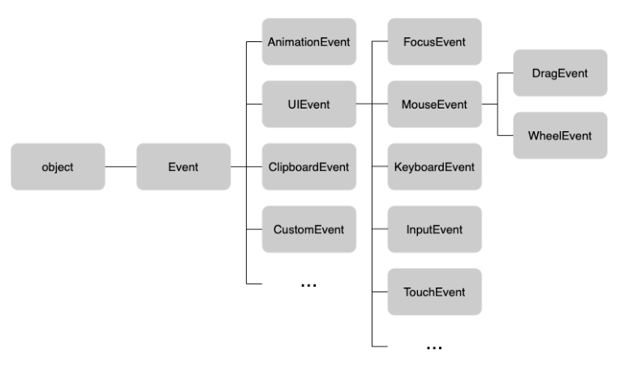

# 40. 이벤트

## 40.1 이벤트 드리븐 프로그래밍

> 브라우저는 처리해야할 특정 사건이 발생하면 이를 감지하여 이벤트를 발생시킨다. 클릭, 키보드 입력, 마우스 이동 등이 일어나면 브라우저는 특정한 타입의 이벤트를 발생시킨다.

> 이벤트가 발생했을 때 호출될 함수를 브라우저에게 알려 호출을 위임한다. 호출될 함수를 이벤트 핸들러 라 하고
> 이벤트가 발생했을 때 브라우저에게 이벤트 핸들러의 호출을 위임하는 것을 이벤트 핸들러 등록이라 한다.

> 브라우저는 사용자의 버튼 클릭을 감지하여 클릭 이벤트를 발생시킬 수 있다.
> 특정 버튼 요소에서 클릭 이벤트가 발생하면 특정 함수를 호출하도록 브라우저에게 위임 할 수 있다.
> 언제 호출할지 알 수 없으므로 개발자가 명시적으로 함수를 호출하는 것이 아니라 브라우저에게 함수 호출을 위임하는 것이다.

```javascript
const button = document.querySelector('button');
// 사용자가 버튼을 클릭하면 함수를 호출하도록 요청
button.onclick = () => { alert('button click')};
```

> 위 예제를 살펴보면 버튼 요소 button onclick 프로퍼티에 함수를 할당했다.
> Window, document, HTMLElement 타입의 객체는 onclick 과 같은 특정 이벤트에 대응하는
> 다양한 이벤트 핸들러 프로퍼티를 가지고 있다. 프로퍼티에 함수를 할당하면 해당 이벤트가 발생했을 떄
> 함수가 브라우저에 의해 호출된다.

> 이벤트와 그에 대응하는 함수를 통해 사용자와 애플리케이션은 상호작용 가능하다.
> 이와 같이 프로그램의 흐름을 이벤트 중심으로 제어하는 프로그래밍 방식을 이벤트 드리븐 프로그래밍이라 한다.

## 40.2 이벤트 타입

> 이벤트 타입은 이벤트의 종류를 나타내는 문자열이다.

### 40.2.1 마우스 이벤트

| 이벤트 타입     | 이벤트 발생 시점                          |
|------------|------------------------------------|
| click      | 마우스 버튼을 클릭했을 때                     |
| dbclick    | 더블클릭                               |
| mousedown  | 마우스 버튼을 눌렀을 때                      |
| mouseup    | 마우스를 놓았을 때                         |
| mousemove  | 마우스 커서 움직였을 때                      |
| mouseenter | 마우스 커서를 HTML 요소 안으로 이동했을 떄 (버블링 x) |
| mouseover  | 마우스 커서를 HTML 요소 안으로 이동했을 때 (버블링 o) |
| mouseleave | 마우스 커서를 HTML 요소 밖으로 이동했을 때 (버블링 x) |
| mouseout   | 마우스 커서를 HTML 요소 밖으로 이동했을 때 (버블링 o) |

### 40.2.2 키보드 이벤트

| 이벤트 타입   | 이벤트 발생 시점                  |
|----------|----------------------------|
| keydown  | 모든 키를 눌렀을 때 발생한다.          |
| keypress | 문자 키를 눌렀을 때 연속적으로 발생한다.    |
| keyup    | 누르고 있던 키를 놓았을 때 한 번만 발생한다. |

### 40.2.3 포커스 이벤트

| 이벤트 타입   | 이벤트 발생 시점                     |
|----------|-------------------------------|
| focus    | HTML 요소가 포커스를 받았을 때           |
| blur     | HTML 요소가 포커스를 잃었을 때           |
| focusin  | HTML 요소가 포커스를 받았을 때 ( 버블링 o ) |
| focusout | HTML 요소가 포커스를 잃었을 때 ( 버블링 o ) |

> focusin, focusout 이벤트 핸들러를 이벤트 핸들러 프로퍼티 방식으로 등록하면 크롬, 사파리에서 정상 동작하지 않는다.
> focusin, focusout 이벤트 핸들러는 addEventListener 메서드 방식을 사용해 등록해야 한다.

### 40.2.4 폼 이벤트

1. submit 
    - form 요소 내의 input, select 입력 필드 내에서 엔터키를 눌렀을 때
    - form 요소 내의 submit 버튼을 클릭했을 때
2. reset
   - form 요소 내의 reset 버튼을 클릭했을 때

### 40.2.5 값 변경 이벤트

1. input
   - input, select, textarea 요소의 값이 입력되었을 때
2. change
   - input, select, textarea 요소의 값이 변경되었을 때
3. readystatechange
   - html 문서의 로드와 파싱 상태를 나타내는 document.readystate 프로퍼티 값

### 40.2.6 DOM 뮤테이션 이벤트

1. DOMContentLoaded
   - HTML 문서와 로드와 파싱이 완료되어 DOM 생성이 완료되었을 때

### 40.2.7 뷰 이벤트

1. resize
   - 브라우저 윈도우의 크기를 리사이즈할 때 연속적으로 발생한다.

2. scroll
   - 웹페이지 또는 HTML 요소를 스크롤할 때 연속적으로 발생한다.

### 40.2.8 리소스 이벤트

1. load
   - DOMContentLoaded 이벤트가 발생한 이후, 모든 리소스의 로딩이 완료되었을 때
2. unload
   - 리소스가 언로드될 떄
3. abort
   - 리소스 로딩이 중단되었을 떄
4. error
   - 리소스 로딩이 실패했을 때

## 40.3 이벤트 핸들러 등록

> 이벤트 핸들러는 이벤트가 발생했을 때 브라우저에 호출을 위임한 함수다.
> 다시 말해 이벤트가 발생하면 브라우저에 의해 호출될 함수가 이벤트 핸들러다.

> 이벤트가 발생했을 때 브라우저에게 이벤트 핸들러의 호출을 위임하는 것을 이벤트 핸들러 등록이다 한다.

### 40.3.1 이벤트 핸들러 어트리뷰트 방식

> HTML 요소의 어트리뷰트 중에는 이벤트에 대응하는 이벤트 핸들러 어트리뷰트가 있다.

> 주의할 점은 이벤트 핸들러 어트리뷰트 값으로 함수 참조가 아닌 함수 호출문 등의 문을 할당한다는 뜻이다.

> 이벤트 핸들러 등록이란 함수 호출을 브라우저에게 위임하는 것이라 했다. 이벤트 핸들러를 등록할때 콜백 함수와 마찬가지로 함수 참조를 등록해야
> 브라우저가 이벤트 핸들러를 호출할 수 있다.

> 만약 함수 참조가 아니라 함수 호출문을 등록하면 함수 호출문의 평가 결과가 이벤트 핸들러로 등록된다.

> 이벤트 핸들러 어트리뷰트 값은 사실 암묵적으로 생성될 이벤트 핸들러의 함수 몸체를 말한다.

### 40.3.2 이벤트 핸들러 프로퍼티 방식

> window 객체와 Document, HTMLElement 타입의 DOM 노드 객체는 이벤트에 대응하는 이벤트 핸들러 프로파티를 가지고 있다.

> 이벤트 핸들러를 등록하기 위해서는 이벤트를 발생시킬 객체인 이벤트 타킷과 이벤트의 종류를 나타내는 문자열인 이벤트 타입과 이벤트 핸들러를 지정할 필요가 있다.
> 예를 들어 버튼 요소가 클릭되면 handleClick 함수를 호출하도록 이벤트 핸들러를 등록하는 경우 이벤트 타깃은 버튼 요소이고 이벤트 타입은 click 이며 핸들러는 handleClick 함수다.

> 이벤트 핸들러는 대부분 이벤트를 발생시킬 이벤트 타깃에 바인딩된다. 
> 하지만 반드시 이벤트 타깃에 이벤트 핸들러를 바인딩해야 하는 것은 아니다.

### 40.3.3 addEventListener 메서드 방식

> DOM Level 2 에서 도입된 EventTarget.prototype.addEventListener 메서드를 사용하여 이벤트 핸들러를 등록할 수 있다.
> 앞서 살펴본 이벤트 핸들러 어트리뷰트, 핸들러 프로퍼티 방식은 DOM Level 0 이다.

> addEventListener 메서드의 첫 번째 매개변수에는 이벤트의 종류를 나타내는 문자열인 이벤트 타입을 전달한다.

> 이때 이벤트 핸들러 프로퍼티 방식과는 달리 on 접두사를 붙이지 않는다.

> 이벤트 핸들러 프로퍼티 방식은 이벤트 핸들러 프로퍼티에 이벤트 핸들러를 바인딩하지만
> addEventListener 메서드에는 이벤트 핸들러를 인수로 전달한다. 만약 동일한 HTML 요소에서 발생한 동일한 이벤트에 대해

> 이벤트 핸들러 프로퍼티 방식과 addEventListener 메서드 방식을 모두 사용할 경우
> 두 이벤트 핸들러가 모두 호출된다.

> addEventListener 이벤트는 하나 이상의 이벤트 핸들러를 등록 가능하다.

> 단 메서드를 통해 참조가 동일한 이벤트 핸들러를 중복 등록하면 하나만 등록된다.

## 40.4 이벤트 핸들러 제거

> removeEventListener 메서드를 사용한다. 전달할 인수는 addEventListener 와 동일하다

## 40.5 이벤트 객체

> 이벤트가 발생하면 이벤트에 관련한 다양한 정보를 담고 있는 이벤트 객체가 동적으로 생성된다.
> 이벤트 객체는 이벤트 핸들러의 첫 번째 인수로 전달된다.

### 40.5.1 이벤트 객체의 상속 구조

> 이벤트가 발생하면 이벤트 타입에 따라 다양한 타입의 이벤트 객체가 생성된다. 이벤트 객체는 다음과 같은 상속 구조를 갖는다.



> 이벤트가 발생하면 암묵적으로 생성되는 이벤트 객체도 생성자 함수에 의해 생성된다. 생성된 이벤트 객체는
> 생성자 함수와 더불어 생성되는 프로토타입으로 구성된 프로토타입 체인의 일원이 된다.

> 이벤트 객체 중 일부는 사용자의 행위에 의해 생성된 것이고 일부는 자바스크립트 코드에 의해 인위적으로 생성된 것이다.

> MouseEvent 타입의 이벤트 객체는 사용자가 마우스를 클릭하거나 이동했을 떄 생성되는 이벤트 객체이며, CustomEvent 타입의 이벤트 객체는
> 자바스크립트 코드에 의해 인위적으로 생성한 이벤트 객체다.

> Event 인터페이스는 DOM 내에서 발생한 이벤트에 의해 생성되는 이벤트 객체를 나타낸다.
> 인터페이스에는 모든 이벤트 객체의 공통 프로퍼티가 정의되어 있고 FocusEvent, MouseEvent, KeyboardEvent
> 같은 하위 인터페이스에는 이벤트 타입에 따라 고유한 프로퍼티가 정의되어 있다.

### 40.5.2 이벤트 객체의 공통 프로퍼티

> Event 인터페이스, 즉 Event.prototype에 정의되어 있는 이벤트 관련 프로퍼티는 UIEvent, CustomEvent, MouseEvent 등 모든 파생 이벤트 객체에 상속된다.

> Event 인터페이스의 이벤트 관련 프로퍼티는 모든 이벤트 객체가 상속받는 공통 프로퍼티다.

- type
  - 설명: 이벤트 타입
  - 타입: string

- target
  - 설명: 이벤트를 발생시킨 DOM 요소
  - 타입: DOM 요소 노드

- currentTarget
  - 설명: 이벤트 핸들러가 바인딩된 DOM 요소
  - 타입: DOM 요소 노드

- eventPhase
  - 설명: 이벤트 전파 단계
  - 0: 이벤트 없음, 1: 캡쳐링 단계, 2: 타킷 단계, 3: 버블링 단계
  - 타입: number

- bubbles
  - 설명: 이벤트를 버블링으로 전파하는지 여부, 다음 이벤트는 bubbles: false 로 버블링하지 않는다.
  - 포커스 이벤트 focus/blur
  - 리소스 이벤트 load/unload/abort/error
  - 마우스 이벤트 mouseenter/mouseleave
  - 타입: boolean

- cancelable
  - preventDefault 메서드를 호출하여 이벤트의 기본 동작을 취소할 수 있는지 여부, 다음 이벤트는 cancelable: false 로 취소할 수 없다.
  - 포커스 이벤트 focus/blur
  - 리소스 이벤트 load/unload/abort/error
  - 마우스 이벤트 mouseenter/mouseleave
  - 타입: boolean

- defaultPrevented
  - 설명: preventDefault 메서드를 호출하여 이벤트를 취소했는지 여부
  - 타입: boolean

- isTrusted
  - 설명: 사용자의 행위에 의해 발생한 이벤트인지 여부 
  - 타입: boolean

- timeStamp
  - 설명: 이벤트가 발생한 시각
  - 타입: number

```javascript
const checkbox = document.querySelector('input[type=checkbox]');
const msg = document.querySelector('.message');

// change 이벤트가 발생하면 Event 타입의 이벤트 객체가 생성된다.
checkbox.onchange = e => {
   console.log(Object.getPrototypeOf(e) === Event.prototype); // true
}
```

> 사용자의 입력에 의해 체크박스 요소의 체크 상태가 변경되면 checked 프로퍼티의 값이 변경되고 change 이벤트가 발생한다.
> 이때 Event 타입의 이벤트 객체가 생성된다. 이벤트 객체의 target 프로퍼티는 이벤트를 발생시킨 객체를 나타낸다.

> target 프로퍼티가 가리키는 객체는 change 이벤트를 발생시킨 DOM 요소 checkbox이고 이 객체의 checked 프로퍼티는 현재의 체크 상태를 나타낸다.

> 이벤트 객체의 currentTarget 프로퍼티는 이벤트 핸들러가 바인딩된 DOM 요소를 가리킨다. 위 예제의 경우 이벤트를 발생시킨 DOM 요소와
> 이벤트 핸들러가 바인딩된 DOM 요소는 모두 checkbox 다.
> 따라서 이벤트 객체의 target 프로퍼티의 currentTarget 프로퍼티는 동일한 객체 checkbox 를 가리킨다.

### 40.5.3 마우스 정보 취득

> click, dbclick, mousedown, mouseup, mousemove, mouseenter, mouseleave 이벤트가 발생하면 생성되는
> MouseEvent 타입의 이벤트 객체는 다음과 같은 고유의 프로퍼티를 갖는다.

1. 마우스 포인터의 좌표 정보를 나타내는 프로퍼티
   - screenX/screenY, clientX/clientY, pageX/pageY, offsetX/offsetY
2. 버튼 정보를 나타내는 프로퍼티
   - altKey, ctrlKey, shiftKey, button

### 40.5.4 키보드 정보 취득

> keydown, keyup, keypress 이벤트가 발생하면 생성되는 KeyboardEvent 타입의 이벤트 객체는
> altkey, ctrlkey, shiftkey, metakey, key, keyCode 같은 고유 프로퍼티를 갖는다.

> keyup 이벤트가 발생하면 생성되는 keyboardEvent 타입의 이벤트 객체는 입력한 키 값을 문자열로 반환하는 key 프로퍼티를 제공한다.


## 40.6 이벤트 전파

> DOM 트리 상에 존재하는 DOM 요소 노드에서 발생한 이벤트는 DOM 트리를 통해 전파된다. 이를 이벤트 전파라고 한다.

```html
<html>
<body>
    <ul id="fruits">
       <li id="apple">Apple</li>
       <li id="banana">Banana</li>
       <li id="orange">Orange</li>
    </ul>
</body>
</html>
```

> ul 요소의 두 번째 자식 요소인 li 요소를 클릭하면 클릭 이벤트가 발생한다.
> 생성된 이벤트 객체는 이벤트를 발생시킨 DOM 요소인 이벤트 타깃을 중심으로 DOM 트리를 통해 전파된다.

1. 캡처링 단계, 이벤트가 상위 요소에서 하위 요소 방향으로 전파
2. 타깃 단계 이벤트가 이벤트 타깃에 도달
3. 버블링 단계 이벤트가 하위 요소에서 상위 요소 방향으로 전파

```javascript
const $fruits = document.getElementById('fruits');

$fruits.addEventListener('click', e => {
   console.log(`이벤트 단계: ${e.eventPhase}`); // 3: 버블링
   console.log(`이벤트 타깃: ${e.target}`); // [object: HTMLElement]
   console.log(`커렌트 타깃: ${e.currentTarget}`); // [object HTMLUListElement]
})
```

> li 요소를 클릭하면 클릭 이벤트가 발생하여 클릭 이벤트 객체가 생성되고 클릭된 li 요소가 이벤트 타깃이 된다.
> 클릭 이벤트 객체는 window 에서 시작하여 이벤트 타깃 방향으로 전파된다. 이것이 캡처링 단계다.

> 이후 이벤트 객체는 이벤트를 발생시킨 이벤트 타깃에 도달한다. 이것이 타깃 단게다.

> 이후 이벤트 객체는 이벤트 타깃에서 시작하여 window 방향으로 전파된다. 이것이 버블링 단계다.

> 이벤트 핸들러 어트리뷰트/프로퍼티 방식으로 등록한 이벤트 핸들러는 타깃 단계와 버블링 단계의 이벤트만 캐치할 수 있다.
> 하지만 addEventListener 메서드 방식으로 등록한 이벤트 핸들러는 타깃 단계와 버블링 단계뿐만 아니라
> 캡쳐링 단계의 이벤트도 선별적으로 캐치할 수 있다. 캡처링 단계의 이벤트를 캐리하려면 addEventListener 메서드의
> 3번째 인수로 true를 전달해야 한다. 3번째 인수를 생략하거나 false 를 전달하면 타깃 단계와 버블링 단계의 이벤트만 캐치할 수 있다.

> 이벤트는 이벤트를 발생시킨 이벤트 타깃은 물론 상위 DOM 요소에서도 캐치 가능하다.

> 대부분의 이벤트는 캡처링과 버블링을 통해 전달된다. 하지만 다음 이벤트는 버블링을 통해 전파되지 않는다.
> 이벤트들은 버블링을 통해 이벤트를 전파하는지 여부를 나타내는 이벤트 객체의 공통 프로퍼티 event.bubbles 값이 모두 false 다.

1. 포커스 이벤트: focus/blur
2. 리소스 이벤트: load/unload/abort/error
3. 마우스 이벤트: mouseenter/mouseleave

> 위 이벤트는 버블링되지 않으므로 이벤트 타깃의 상위 요소에서 위 이벤트를 캐치하려면 캡처링 단계의 이벤트를 캐치해야 한다.

> 이벤트를 상위 요소에서 캐치해야 한다면 대체할 수 있는 이벤트가 존재한다.
> focus/blur 이벤트는 focusin/focusout, mouseenter/mouseleave 는 mouseover/mouseout 로 대체 가능하다.

## 40.7 이벤트 위임

> 이벤트 위임은 여러 개의 하위 DOM 요소에 각각 이벤트 핸들러를 등록하는 대신
> 하나의 상위 DOM 요소에 이벤트 핸들러를 등록하는 방법을 말한다.

> 이벤트 위임을 통해 상위 DOM 요소에 이벤트 핸들러를 등록하면 이벤트 타깃 상위 DOM 요소에서 캐치 가능하며
> 하위 DOM 요소에 등록할 필요도 없다.

> 이벤트 위임을 통해 하위 DOM 요소에서 발생한 이벤트를 처리할 때 주의할 점은 상위 요소에 이벤트 핸들러를 등록하기 때문에
> 이벤트 타깃, 이벤트를 실제로 발생시킨 DOM 요소가 개발자가 기대한 DOM 요소가 아닐수도 있다.

## 40.8 DOM 요소의 기본 동작 조작

### 40.8.1 DOM 요소의 기본 동작 중단

> DOM 요소는 저마다 기본 동작이 있다. a 요소를 클릭하면 href 어트리뷰트에 지정된 링크로 이동하고
> checkbox 또는 radio 요소를 클릭하면 체크 또는 해제된다.

> 이벤트 객체의 preventDefault 메서드는 이러한 DOM 요소의 기본 동작을 중지시킨다.

### 40.8.2 이벤트 전파 방지

> 이벤트 객체의 stopPropagation 메서드는 이벤트 전파를 중지시킨다.


## 40.9 이벤트 핸들러 내부의 this

### 40.9.1 이벤트 핸들러 어트리뷰트 방식

> 이벤트 핸들러 어트리뷰트 값으로 지정한 문자열은 암묵적으로 생성하는 이벤트 핸들러 문이다.

> 이벤트 핸들러에 의해 일반 함수로 호출된다.

### 40.9.2 이벤트 핸들러 프로퍼티 방식와 addEventListener 메서드 방식

> 이벤트 핸들러 프로퍼티 방식과 addEventListener 메서드 방식 모두 이벤트 핸들러 내부의 this 는
> 이벤트를 바인딩한 DOM 요소를 가리킨다.

> 즉 이벤트 핸들러 내부의 this 는 이벤트 객체의 currentTarget 프로퍼티와 같다.

> 화살표 함수로 정의한 이벤트 핸들러는 상위 스코프 this 를 가리킨다.

```javascript
class App {
    constructor() {
        this.$button = document.querySelector('.btn');
        this.count = 0;
        
        this.$button.onclick = this.increase;
    }
    
    increase() {
        this.$button.textContent = ++this.count;
    }
}
new App();
```

> 위 예제 increase 메서드 내부의 this는 클래스가 생성할 인스턴스를 가리키지 않는다.
> 이벤트 핸들러 내부의 this 는 이벤트를 바인딩한 DOM 요소를 가리키기 때문에 increase 메서드 내부의
> this 는 this.$button 을 가리킨다.

> 따라서 increase 메서드를 이벤트 핸들러로 바인딩할 때 bind 메서드를 사용해 this를 전달하여 increase 메서드 내부의 this 클래스가 생성할
> 인스턴스를 바라보게 해야한다.

```javascript
class App {
    constructor() {
        this.$button = document.querySelector('.btn');
        this.count = 0;
        
        this.$button.onclick = this.increase.bind(this);
    }
    
    increase() {
        this.$button.textContent = ++this.count;
    }
}
new App();
```

> 또는 이벤트 핸들러를 화살표 함수로 작성한다.

## 40.10 이벤트 핸들러에 인수 전달

> 함수에 인수를 전달하려면 함수를 호출할 때 전달해야 한다. 이벤트 핸들러 어트리뷰트 방식은
> 함수 호출문을 사용할 수 있기 때문에 인수를 전달 가능하지만
> 이벤트 핸들러 프로퍼티 방식과 addEventListener 메서드 방식의 경우 이벤트 핸들러를 브라우저가 호출하기 때문에
> 함수 호출문이 아닌 함수 자체를 등록해야 한다.
> 따라서 인수를 전달할 수 없다.

> 인수를 전혀 전달할 방법이 없는 것은 아니다.

```javascript
const MIN_USER_NAME_LENGTH = 5;
const $input = document.querySelector('input[type=text]');
const $msg = document.querySelector('.message');

const checkUserNameLength = min => {
    $msg.textContent = $input.value.length < min ? `이름은 ${min} 이상 입력` : "";
}

$input.onblur = () => {
    checkUserNameLength(MIN_USER_NAME_LENGTH);
}
```

> 또는 이벤트 핸들러를 반환하는 함수를 호출 가능하다.

## 40.11 커스텀 이벤트

### 40.11.1 커스텀 이벤트 생성

> 이벤트가 발생하면 암묵적으로 생성되는 이벤트 객체는 발생한 이벤트의 종류에 따라 이벤트 타입이 결정된다.

> 하지만 Event, UIEvent, MouseEvent 같은 이벤트 생성자 함수를 호출하여 명시적으로 생성한 이벤트 객체의 임의의
> 이벤트 타입을 지정 가능하다.

```javascript
const keyboardEvent = new KeyboardEvent('keyup');
const customEvnet = new CustomEvent("foo");
console.log(customEvnet.type); // foo
```

> 생성된 커스텀 이벤트 객체는 버블링이 되지 않으며 preventDefault 메서드로 취소 불가능하다
> bubbles 와 cancelable 이 false 이다.

> 커스텀 이벤트 객체의 bubbles 와 cancelable 를 true 로 설정하려면
> 이벤트 생성자 함수의 두 번째 인수로 bubbles 와 cancelable 프로파티를 갖는 객체를 전달한다.

> 이벤트 생성자 함수로 생성한 커스텀 이벤트는 isTrusted 프로퍼티의 값이 항상 false 이다.

### 40.11.2 커스텀 이벤트 디스패치

> 커스텀 이벤트는 dispatchEvent 메서드로 디스패치 (이벤트를 발생시키는 행위) 가 가능하다.

> 일반적으로 이벤트 핸들러는 비동기 처리 방식으로 동작하지만 dispatchEvent 메서드는
> 이벤트 핸들러를 동기처리 방식으로 호출한다.

> 임의의 커스텀 이벤트를 생성한 경우 addEventListener 메서드 방식으로 핸들러를 등록해야 한다.

> 이벤트 핸들러 어트리뷰트/프로퍼티 방식을 사용할 수 없는 이유는
> on + 이벤트 타입 으로 이루어진 이벤트 핸들러 어트리뷰트/프로퍼티가 요소 노드에 존재하지 않기 떄문이다.

---

- [ ] 이벤트 드리븐 프로그래밍 이란
- [ ] addEventListener / 어트리뷰트 형식 차이

