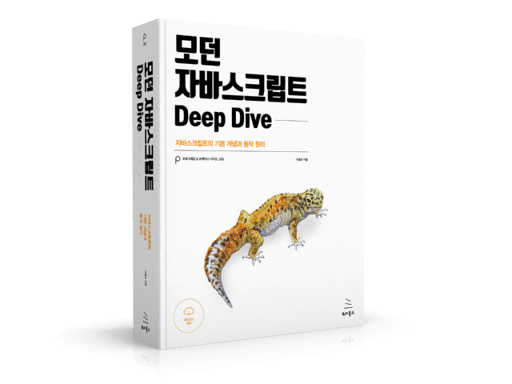

# 모던 자바스크립트 Deep Dive 스터디

  

## ⏰ 시간
- 매 주 화요일 오후 7시

## 📝 진행 방식
- 매 주 주어진 책 분량을 정리하여 서로 발표하는 시간을 가집니다.
- 책을 읽으며 추가로 궁금한 내용이 있으면 issue에 등록합니다.

## ✨ Contributors
<table>
  <tr>
    <td align="center">
      <a href="https://github.com/Vespucci95"
        > <b>이현서</b></a
      > 
    </td>
    <td align="center">
      <a href="https://github.com/wkdtpzld"
        > <b>정광수</b></a
      > 
    </td>
  </tr>
</table>
